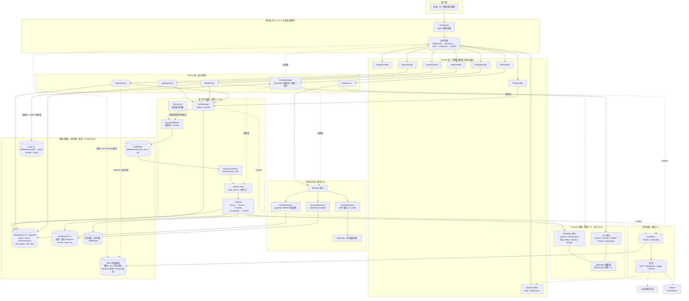
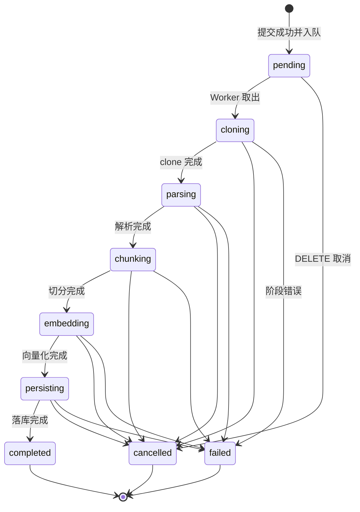
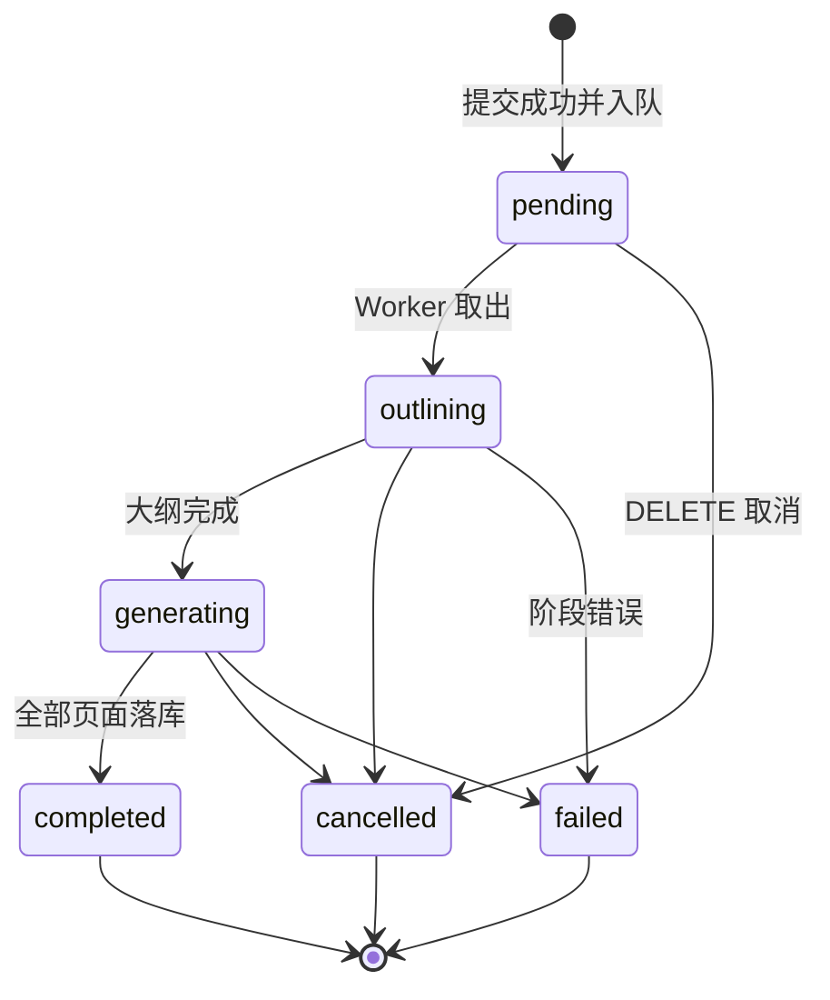
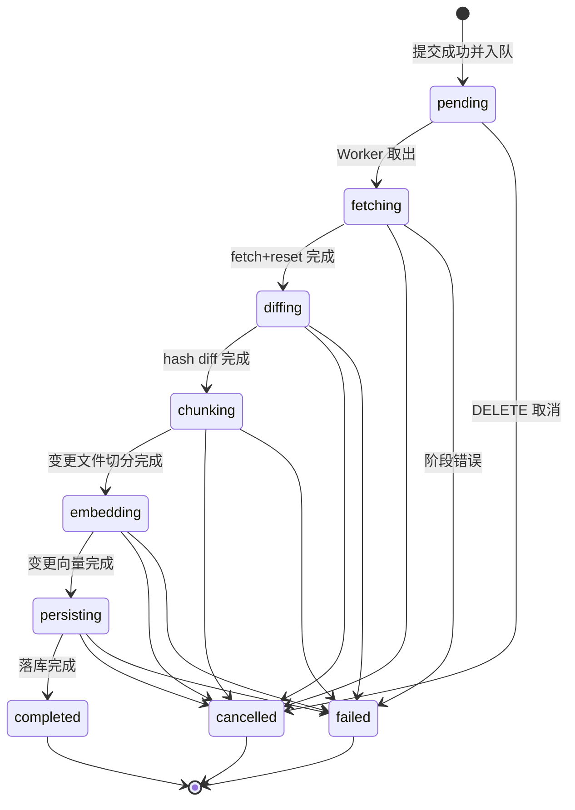

# DeepWiki(Go版) 系统设计基线文档

| 项 | 内容 |
|---|---|
| 文档编号 | DW-DESIGN-BASELINE-00 |
| 版本 | v0.2.0（企业级技术栈版） |
| 状态 | 设计基线（下游文档撰写与编码的唯一权威依据） |
| 适用项目 | 大学暑假考核项目「考题一：DeepWiki(Go版)」 |
| 编写角色 | 资深 Go 分布式系统架构师（RAG 方向） |
| 修订日期 | 2026-07-15 |
| 技术栈基线 | PostgreSQL 16 + pgvector + OpenSearch 2.x + RabbitMQ 3.13 + Redis 7.4（哨兵）+ etcd v3.5 + git CLI + 各厂商官方 SDK |

> **约束声明**：本文档严格执行编排器已确定的设计决策与《企业级技术栈变更总纲 v2.0》（下称「总纲」）的权威契约。API 端点清单（第 5 章）、任务状态机（第 4 章）、核心接口签名（第 7 章）、事件协议、限流规则数值为冻结项，不得增删改。全局约定：JSON 字段统一 snake_case；ID 统一带类型前缀（`tsk_` / `repo_` / `chk_` / `req_` / `wk_`）；时间统一 UTC + RFC3339；所有 API 以 `/api/v1` 为前缀（`/metrics` 除外）。任务状态唯一来源为 PostgreSQL `tasks` 表；RabbitMQ 仅传递瘦消息；配置运行时覆写唯一来源为 etcd。

---

## 1. 项目概述与目标

### 1.1 项目背景

DeepWiki(Go版) 是一个类 DeepWiki 的代码仓库智能问答系统。用户提交 GitHub 仓库 URL 后，系统异步完成「克隆 → 解析 → 切分 → 向量化 → 持久化」全流程；随后用户可针对已摄取的仓库进行语义问答，系统检索相关代码/文档片段并由 LLM 生成带引用的回答（支持流式）；同时系统可异步为仓库生成 Wiki 文档。

v0.2.0 版本将系统整体升级为企业级可水平扩展架构：API 节点无状态化、Worker 节点经 RabbitMQ 消费任务、全部状态集中于 PostgreSQL（含 pgvector 向量检索）、关键词检索由 OpenSearch（BM25）承担、限流/分布式锁/事件总线由 Redis 哨兵集群承担、运行时配置由 etcd 承担。REST 契约、状态机、事件协议、限流数值相对上一版全部冻结不变。

### 1.2 三条核心业务链路

| 链路 | 入口 | 处理路径 | 产出 |
|---|---|---|---|
| 摄取（Ingest） | `POST /api/v1/ingest` | TaskManager → PostgreSQL 落库（pending）→ RabbitMQ 投递瘦消息 → Worker 消费 → Pipeline（Clone→Parse→Chunk→Embedding→Persist） | repos / chunks / pgvector 向量 / OpenSearch 索引落库 |
| 问答（Ask） | `POST /api/v1/ask`、`POST /api/v1/ask/stream` | AskService → Retriever（keyword/embedding/hybrid）→ LLM（Generate/GenerateStream） | 带 references 的回答（同步 JSON 或 SSE 流） |
| Wiki 生成 | `POST /api/v1/wiki/generate` | 与 ingest 共用同一套任务系统（TaskManager + RabbitMQ + Worker Pool） | wiki_pages（TOC + 页面）落库 |

### 1.3 进阶要求落点

| 进阶要求 | 设计落点 |
|---|---|
| 多 LLM Provider | `LLM` 接口 + 5 个实现（OpenAI/Gemini/Claude/Ollama/DeepSeek），全部基于厂商官方 SDK 适配，见第 7 章 |
| 多 Embedding Provider | `Embedder` 接口 + 5 个实现（OpenAI/DashScope/SiliconFlow/Ollama/VoyageAI），OpenAI 兼容端点统一走 openai-go，见第 7 章 |
| 增量更新（Refresh） | git CLI `fetch → reset --hard` + 文件 hash diff，只重处理变更文件；Redis 分布式锁保证同仓 Refresh 互斥，见第 4.7 节 |
| 多仓库管理 | repos 资源族（列表/详情/删除/刷新）+ 全部数据按 `repo_id` 隔离（PostgreSQL 行级隔离 + OpenSearch 每仓一索引），见第 5、12 章 |

### 1.4 设计目标

1. **一致性**：ingest / refresh / wiki 三类任务共用同一套任务模型、状态机、RabbitMQ 队列拓扑、Worker Pool、查询/取消端点（建议⑩的彻底化）。
2. **可插拔**：LLM / Embedding / Retriever / VectorStore / QueuePublisher / RateLimiter / ConfigSource 全部接口化，替换实现不改业务层（答辩话术："可插拔 Retriever / Provider"）。
3. **可观测**：EventBus（Redis Streams + Pub/Sub）统一事件总线跨节点扇出到 SSE / WebSocket / Logger / Metrics；health 返回丰富运行时信息（Postgres/OpenSearch/RabbitMQ/Redis/etcd/git 逐项体检）；可选 OpenTelemetry 分布式链路追踪。
4. **健壮性**：两级限流（Redis Lua 滑动窗口，多副本全局一致）+ RabbitMQ 有界队列背压；任务状态全部落 PostgreSQL，Worker 崩溃由 Reconciler 重建队列视图，重启可恢复；publisher confirm + manual ack 保证任务不丢；优雅退出；密钥不落盘不入日志、API Key 落库仅存 SHA-256(salt‖key) 哈希。
5. **可水平扩展**：API 节点无状态可多副本；Worker 节点多副本经 RabbitMQ 天然负载均衡；CAS 抢占保证多节点消费幂等。
6. **可答辩**：内置「反 AI 常见错误清单」（第 10 章，18 条）作为工程化对照表，逐条在设计中闭环。

### 1.5 非目标（明确边界）

- 不做多租户计费与配额账单体系，仅 API key（普通/admin 两级）鉴权与 per-key 限流配额。
- 不做 SSO / OAuth / RBAC 复杂权限体系。
- 不做跨 DB 的分布式事务（2PC/XA）：PostgreSQL 单库事务 + 「DB 先提交、外部资源后跟进、失败后台补偿」的最终一致策略已足够。
- 不做 Kubernetes Operator / 自动扩缩容控制面；水平扩展能力以「无状态 API + 多副本 Worker + compose/集群部署手册」形态交付。
- 不做向量维度在线变更：`storage.vector.dimensions` 建表定型，改维度 = 新迁移 + 全量重建（流程见 §12.4）。
- 不做前端实现；前端仅消费本文档定义的 API / SSE / WebSocket 契约。

---

## 2. 系统架构图与架构分层说明

### 2.1 系统架构图（Mermaid）



### 2.2 部署形态图（API 无状态 + Worker 消费队列）

```text
                 ┌──────────────┐
   Client ──LB──▶│ API 节点 × N  │（无状态：Gin + 限流中间件 + SSE/WS 推送）
                 └──┬───┬───┬───┘
                    │   │   │
   ┌────────────────┘   │   └──────────────────┐
   ▼                    ▼                      ▼
┌─────────┐      ┌────────────┐        ┌─────────────┐
│Postgres │      │  RabbitMQ   │        │ Redis 哨兵集群│
│+pgvector│      │  队列集群   │        │(1主2从3哨兵) │
└─────────┘      └─────┬──────┘        └─────────────┘
                       │ consume          ▲
                 ┌─────▼──────┐           │
                 │Worker 节点×M│───────────┘（分布式锁/限流/事件总线）
                 └─┬────────┬─┘
                   ▼        ▼
            ┌───────────┐ ┌──────────┐
            │ OpenSearch │ │  etcd    │   + 共享卷（仓库工作目录）
            │  3 节点    │ │  3 节点  │
            └───────────┘ └──────────┘
```

- **API 节点无状态**：不持有任务执行、不持有本地索引；SSE/WS 连接的状态（订阅关系）仅在内存，事件经 Redis Pub/Sub 扇入。
- **Worker 节点**：消费 RabbitMQ；仓库工作目录需共享卷（`./data/repos` 挂载 NFS/PVC），或单 worker 节点本地盘（课程/中小企业规模推荐后者，两种形态均支持，见 §12.9）。
- **配置**：yaml + env 只引导「基础设施坐标」（DSN、endpoints）；运行时业务配置全部在 etcd。

### 2.3 架构分层说明

| 层 | 职责 | 关键组件 | 依赖规则（禁止项） |
|---|---|---|---|
| 接入层 | HTTP 路由、中间件、协议升级（SSE/WS） | Gin Router、RequestID/Recovery/Auth/RateLimit/CORS 中间件 | 不含任何业务逻辑 |
| Handler 层 | 参数绑定与校验（validator）、统一信封装配、错误码映射 | 8 个 Handler | 不直接访问 DB / Provider / MQ；只调 Service |
| Service 层 | 业务编排：幂等判断、RAG 流程、Wiki 编排、配置热更新 | IngestService / RepoService / AskService / WikiService / ConfigManager | 只依赖 domain 接口，不依赖任何 provider SDK 具体类型 |
| 任务系统 | 三类任务的统一生命周期：落库、投递、调度、取消、状态推进 | TaskManager、QueuePublisher、QueueConsumer、Reconciler、Worker Pool、Pipeline | Pipeline 每阶段入口与循环内必须 `select ctx.Done()` |
| 队列层（queue 包） | RabbitMQ 连接管理、拓扑声明、瘦消息发布/消费 | rabbitmq.go / publisher.go / consumer.go / reconciler.go | 消息体只携带 `task_id` + `type`（≤4KB），禁止携带任务状态/进度 |
| 检索层（search 包） | OpenSearch 客户端与索引生命周期 | 建索引 / 删索引 / count 校验 / bulk 写入 | KeywordRetriever 只面向 search 包接口，不裸拼 HTTP |
| 限流层（ratelimit 包） | Redis Lua 滑动窗口 + 进程内降级兜底 | limiter.go / redis_lua.go / fallback.go | Redis 不可用自动降级 x/time/rate 并 WARN，不可用性优先 |
| 锁层（lock 包） | Redis 分布式锁（Refresh 互斥） | redis_lock.go（SET NX PX + Lua 解锁） | 不引入 watchdog；自动过期 + CAS 兜底 |
| 检索与生成 | 可插拔 Retriever（keyword/embedding/hybrid/+rerank） | Retriever 接口及 3+1 实现 | AskService 不直接访问向量列/OpenSearch，只面向 Retriever 接口（建议⑥） |
| Provider 抽象 | LLM 与 Embedding 的厂商无关抽象 | LLM / Embedder 接口 + 各 5 个实现（官方 SDK 适配） | domain 层禁止泄漏任何官方 SDK 类型；adapter 层负责类型转换 |
| 事件系统 | 任务与系统事件的发布订阅、跨节点扇出 | EventBus（Redis Streams + Pub/Sub） | WS/SSE Handler 不得直接订阅 Task，只订阅 EventBus（建议⑪） |
| 存储层 | 全部状态持久化 | PostgreSQL（repos/tasks/chunks/wiki_pages/api_keys，pgvector 向量列）、OpenSearch 索引、仓库工作目录 | SQL 全部参数化（`$n` 占位）；任务状态禁止纯内存 map（反 AI 错误 #3） |
| 配置层（config 包） | viper 引导 + etcd 运行时覆写 + watch | loader.go / etcd_source.go / manager.go | 密钥只走环境变量，禁止写入 etcd/yaml/日志 |

**依赖方向铁律**：`model`（接口与结构体）位于最内层；`adapter`（provider 官方 SDK、git CLI、OpenSearch、pgx、RabbitMQ、Redis、etcd 封装）位于最外层并实现 model 接口；Service 与 Pipeline 只 import model。任何官方 SDK 类型出现在 model 包中即视为架构违规（反 AI 错误 #17）。

---

## 3. 用户 14 条建议逐条落地对照表

| # | 建议摘要 | 设计落点 | 所在章节 |
|---|---|---|---|
| ① | ingest 不得直接 `go ingest()`，必须 HTTP → TaskManager → Worker Pool → Pipeline，并发受限、其余排队 | 统一任务系统：TaskManager.Submit 落 PostgreSQL（pending）→ RabbitMQ 投递瘦消息，Worker Pool（每节点默认 2，prefetch 控制）消费，Pipeline 五阶段 | §2、§4.1~4.4 |
| ② | 状态机固定 pending→cloning→parsing→chunking→embedding→persisting→completed；终态 failed/cancelled；WS/SSE 直推状态字段 | 单一 `state` 字段（不设 status 二义字段）；事件 payload 为结构化字段直推 | §4.2、§4.3、§6.4 |
| ③ | 支持取消：DELETE 取消，Worker 通过 ctx.Done() 检测 | `DELETE /api/v1/tasks/{task_id}`（202）；SetCancelFlag + cancel context；Pipeline 逐阶段检查；多节点下 Worker 阶段检查点重读 cancel_flag | §4.5、§5.1 |
| ④ | ask 支持 mode 参数 keyword/embedding/hybrid，方便 AB 测试 | `AskRequest.mode`；`Retriever.Mode()`；三种 Retriever 实现可插拔 | §6.2、§7 |
| ⑤ | references 必须含 path/start_line/end_line/language/score/chunk_id | `AskResponse.references[]` 完整字段（另含 snippet） | §6.2、§6.3 |
| ⑥ | Ask 不得直接访问向量库，必须抽象 Retriever 接口，BM25/Embedding/Hybrid/Rerank 均实现之 | `Retriever` 接口 + Keyword（OpenSearch BM25）/ Vector（pgvector HNSW）/ Hybrid 实现 + Rerank 装饰器 | §2.3、§7 |
| ⑦ | Embedding Provider 化：Embedder 接口，5 实现 | `Embedder` 接口（Embed/Dimensions/ProviderName/ModelName），官方 SDK 适配 | §7、§8 |
| ⑧ | LLM Provider 化：LLM 接口，5 实现；Generate 与 GenerateStream 统一 | `LLM` 接口；流式与非流式共用 `ChatRequest` 结构体；SDK 内置重试 + gobreaker 熔断 | §7、§8 |
| ⑨ | Refresh 禁止 git pull；fetch → reset --hard → 文件 hash 增量；或临时目录 clone 后原子切换 | git CLI 实现 `Cloner.FetchAndReset`（`fetch --depth 1` + `reset --hard FETCH_HEAD` + `clean -fdx`）；chunks 表 `file_hash` 列做 diff；clone 落 `.tmp` 后 `os.Rename` 原子切换；Redis 分布式锁保证同仓互斥 | §4.7、§7、§12.8 |
| ⑩ | Wiki 生成异步：返回 202 + task_id，与 ingest 共用任务系统 | `POST /api/v1/wiki/generate` → 202；wiki 任务状态机 pending→outlining→generating→completed；同一 RabbitMQ 队列与 Worker Pool | §4.3、§5.1、§6.7 |
| ⑪ | WS 不得直接订阅 Task，必须抽象 EventBus 扇出到 WS/SSE/Logger/Metrics | `EventBus` 接口（Publish/Subscribe + EventFilter）；Redis Streams 事件日志（`XTRIM MAXLEN ~ 1000`）支持断线补发，Pub/Sub 跨节点扇出 | §2、§6.4、§7 |
| ⑫ | API 版本化 /api/v1/ | 全部端点 `/api/v1` 前缀（`/metrics` 除外） | §5.1、§5.7 |
| ⑬ | Health 返回丰富信息 | `GET /api/v1/health`：status/version/uptime/llm/embedding/postgres/opensearch/rabbitmq/redis/etcd/git/worker(busy,total,queued) | §6.6 |
| ⑭ | 动态配置 GET/PUT，运行时改 top_k/chunk_size/llm/embedding/temperature；校验 + 脱敏 | JSON Merge Patch 语义部分更新；校验失败整体拒绝（42201）；etcd Txn 原子写入（overrides + version+1 + audit 同一事务）+ watch 全节点热生效；密钥脱敏返回 | §6.5、§8 |

---

## 4. 统一任务系统（ingest / refresh / wiki 三类任务共用）

### 4.1 设计原则

1. **单一入口**：任何后台长任务（ingest / refresh / wiki）都必须经由 `HTTP Handler → Service → TaskManager.Submit → PostgreSQL 落库（pending）→ RabbitMQ 投递 → Worker Pool → Pipeline`，**禁止**在任何位置直接 `go ingest(...)` 之类绕过任务系统（建议①）。
2. **状态落库（唯一来源）**：任务创建即在 PostgreSQL 事务内写入 `tasks` 表，之后每次状态/进度推进都更新该表。内存中只允许存在「运行中任务的 context 句柄与取消函数」，不作为状态来源；RabbitMQ 消息只携带 `task_id` + `type`，**禁止**在消息里携带任务状态/进度（反 AI 错误 #3、#16）。
3. **单一状态字段**：任务生命周期只由 `state` 一个字段表达，禁止另设 `status`/`phase` 等字段造成二义（建议②）。
4. **一切皆可取消**：每个任务持有独立 `context.Context`；取消 = 置 `cancel_flag` + 调 cancel 函数；Pipeline 每阶段入口与循环内 `select ctx.Done()`（建议③）。
5. **消费幂等**：RabbitMQ 为 at-least-once 投递，Worker 执行前必须 CAS 抢占任务（`UPDATE tasks SET state='cloning' ... WHERE task_id=$1 AND state='pending'`），CAS 失败直接 ack 丢弃，禁止假设消息恰好一次（反 AI 错误 #18）。

### 4.2 Task 模型完整字段表

| 字段 | 类型 | 必填 | 说明 |
|---|---|---|---|
| `task_id` | string | 是 | `tsk_` 前缀 + ULID，如 `tsk_01J2X9K7QZ...` |
| `type` | string(enum) | 是 | `ingest` \| `refresh` \| `wiki` |
| `repo_id` | string | 是 | `repo_` 前缀 ULID；仓库被删除后历史任务的该字段置 NULL（任务历史保留） |
| `state` | string(enum) | 是 | 见 §4.3 状态机；唯一状态字段 |
| `progress` | object | 是 | `{current, total, percent}`；`total=0` 表示该阶段总量未知（不确定进度条） |
| `progress.current` | int | 是 | 阶段内已完成单位数 |
| `progress.total` | int | 是 | 阶段内总单位数（0=未知） |
| `progress.percent` | int | 是 | 阶段内百分比 0~100 |
| `stats` | object | 是 | `{files, chunks, tokens}`，随阶段累计更新；无数据时全 0 |
| `stats.files` | int | 是 | 已处理文件数 |
| `stats.chunks` | int | 是 | 已产出 chunk 数 |
| `stats.tokens` | int | 是 | 已处理近似 token 数（按 §12.4 估算规则） |
| `error` | object\|null | 否 | 失败时 `{code, message, stage}`；正常/运行中为 `null`。`code` 复用统一错误码空间（如 50004）；`message` 为脱敏后的面向用户描述；`stage` 为失败时所处的 state |
| `queue_position` | int | 是 | 排队中时有效（≥1）；被 Worker 取出后归 0 |
| `cancel_flag` | bool | 是 | 取消标记（不落 API 响应，仅存储/调度用） |
| `request_payload` | json | 是 | 原始请求参数快照（重试/审计用，不落 API 响应） |
| `created_at` | string(RFC3339) | 是 | 创建时间（UTC） |
| `started_at` | string(RFC3339)\|null | 否 | Worker 取出开始执行的时间 |
| `finished_at` | string(RFC3339)\|null | 否 | 进入终态的时间 |

**进度语义约定**（前端折算整体进度的依据）：`progress` 为**阶段内**进度。整体进度按阶段权重折算——ingest：`cloning 15% / parsing 10% / chunking 10% / embedding 50% / persisting 15%`；wiki：`outlining 10% / generating 90%`；refresh：`fetching 20% / diffing 10% / chunking 10% / embedding 45% / persisting 15%`。

### 4.3 三类任务状态机

**ingest 任务**：



**wiki 任务**：



**refresh 任务**：



**状态转移规则**：

| 规则 | 说明 |
|---|---|
| 合法转移 | 仅允许状态机图中定义的转移；`UpdateState` 内置转移校验表，非法转移返回 `40902 invalid_task_state` |
| 终态 | `completed` / `failed` / `cancelled`，进入终态必须写 `finished_at`，且不可再转移 |
| failed 必填 error | 任何非终态 → `failed` 时必须同时写入 `error{code,message,stage}` |
| 无变更 fast-path | refresh 若远端 commit 未变，仍依次经过 fetching→diffing→chunking→embedding→persisting（各阶段零工作量快速通过）→ completed，`stats` 全 0。**不新增状态转移** |
| 级联联动 | ingest 完成 → `repos.state` 置 `ready`；ingest 失败 → `repos.state` 置 `error`；`auto_wiki=true` 时 ingest 进入 completed 后由 TaskManager 自动创建并提交一个 wiki 任务 |

### 4.4 Worker Pool 与背压（RabbitMQ 拓扑）

| 参数 | 配置项 | 默认值 | 约束 |
|---|---|---|---|
| Worker 并发数（每节点） | `worker.pool_size` | 2 | 1~16；热更新生效（扩容即起新 worker；缩容为"软缩容"：多余 worker 停止取新任务，手头任务完成后自然退出） |
| 队列容量 | `worker.queue_size` | 100 | 1~1000；映射 RabbitMQ 队列 `x-max-length`；热更新对新投递检查即时生效（变更后由 queue 包重建/重声明队列参数） |
| 预取数 | `queue.rabbitmq.prefetch` | = `worker.pool_size` | 每 Worker 节点 `Channel.Qos(prefetch)`，控制单节点在途消息数 |
| 重试次数 | `queue.rabbitmq.max_retries` | 3 | DLX 延迟重试链次数，耗尽后任务落 failed |

**RabbitMQ 拓扑**：

| 组件 | 名称 | 关键参数 |
|---|---|---|
| 主交换机 | `deepwiki.tasks`（direct） | 持久化 |
| 主队列 | `deepwiki.task.jobs` | `x-max-length = worker.queue_size`（默认 100）、`x-dead-letter-exchange = deepwiki.tasks.dlx`、持久化 |
| 死信交换机 | `deepwiki.tasks.dlx`（direct） | 承载重试与死信路由 |
| 重试队列 | `deepwiki.task.retry.{5s,30s,5m}` | 每级 TTL 到期后经 DLX 回流主队列，最多 `max_retries`（默认 3）次 |
| 死信队列 | `deepwiki.task.dlq` | 重试耗尽 / 显式拒绝的消息落脚处，供人工排查 |

**瘦消息协议**：消息体 = `{"task_id":"tsk_...","type":"ingest|refresh|wiki"}`，≤ 4KB；任务状态/进度/参数一律不写进消息，权威状态唯一来源为 PostgreSQL `tasks` 表。

**投递流程（Submit）**：

1. `TaskManager.Submit`：在 PostgreSQL 事务内插入 `tasks` 行（`state=pending`，`queue_position=当前队列深度+1`）→ 事务提交。
2. 投递前 `QueueDeclarePassive` 读取主队列 `Messages` 深度：≥ `x-max-length` → 任务落库为 `failed`（`error.code=42902`），API 返回 **429 + `42902 queue_full` + `Retry-After` 头**（估算规则见 §9.4）。
3. `Channel.Publish`（`mandatory=true` + publisher confirm，持久化消息）：confirm 失败/无路由 → 任务落库 `failed`（`error.code=50302`），API 返回 **503 + `50302 queue_unavailable`**。

**消费流程（Worker 循环）**：

1. 每 Worker 节点 `prefetch = worker.pool_size`（默认 2），manual ack。
2. 收到消息 → 读 PostgreSQL 校验任务仍为 pending（CAS：`UPDATE tasks SET state='cloning' ... WHERE task_id=$1 AND state='pending'`；wiki/refresh 任务为其各自的首个运行态）→ CAS 失败说明别的节点已抢占或任务已取消，直接 ack 丢弃（反 AI 错误 #18）。
3. CAS 成功 → 查 `cancel_flag`（已取消则直接落 `cancelled`）→ 写 `started_at` → 按 type 执行对应 Pipeline，逐阶段 `UpdateState` + `EventBus.Publish`。
4. Worker 内全部逻辑包裹 `recover()`：panic → nack `requeue=false` 进 DLX 重试链 + 堆栈入日志；重试耗尽 → 任务落 `failed`（`error.code=50003` / panic 场景 50001）（反 AI 错误 #4）。
5. 瞬时错误（网络抖动、上游 5xx）→ nack `requeue=false` 进 DLX 延迟重试链（5s → 30s → 5m）。
6. 任务进入终态落库后 → **ack**。
7. **进度落库节流**：内存中实时推进度并 Publish 事件，落库频率限制为每 500ms 或每推进 5% 一次（二者先到为准），避免 PostgreSQL 被高频 UPDATE 打满。

### 4.5 取消机制

| 场景 | 行为 |
|---|---|
| 任务在队列中（pending） | `DELETE /api/v1/tasks/{task_id}` → PostgreSQL 置 `cancel_flag=1`；Worker 消费时 CAS 前发现 flag 直接落 `cancelled`（写 `finished_at`）并 ack，不执行任何阶段 |
| 任务运行中 | 置 `cancel_flag=1` + 若任务在本节点运行则调用该任务的 cancel 函数；Pipeline 当前阶段在下一个 `ctx.Done()` 检查点退出（阶段入口、文件循环、batch 循环、外部调用均由 ctx 控制超时/取消）；多节点部署下 Worker 在每个阶段检查点重读 `cancel_flag`（PostgreSQL 为唯一状态来源），跨节点取消同样生效；Worker 捕获 `ctx.Err()` 后落 `cancelled` |
| 任务已终态 | 返回 **409 `40902 invalid_task_state`** |
| API 返回 | 取消受理成功返回 **202**，body 为当前 task 快照（`state` 可能尚未变为 cancelled，前端经 SSE/WS 收 `task.state_changed` 终态事件） |
| 取消粒度保证 | 所有外部 I/O（git 操作、embedding、LLM、DB、MQ）均传入任务 ctx；git CLI 经 `exec.CommandContext` 取消子进程；各官方 SDK 调用均接受 ctx 中断 |

### 4.6 持久化与重启恢复（Reconciler）

1. **PostgreSQL 为唯一状态来源**：队列中没有任何权威状态，Worker 崩溃/重启不丢任务视图。
2. **启动恢复（Reconciler）**：Worker 启动时扫描 PostgreSQL 中非终态任务——
   - `pending` 且无消费者持有 → 重新投递瘦消息到 RabbitMQ；
   - 运行态（cloning/parsing/...）且 `updated_at` 超过 5 分钟无心跳 → 重置为 `pending` 并重投（幂等 CAS 保证安全，重复消费被抢占校验丢弃）。
3. **优雅退出**：SIGINT/SIGTERM → readiness 置失败（health 返 50301）→ 停接新请求 → `Channel.Cancel` 停拉新消息 → 等在途任务完成（上限 `server.shutdown_timeout`）→ 未完成者 nack `requeue=true` 让其他节点接走 → 超过预算仍未完成且 requeue 失败的任务落库 `failed`（`error = {code: 50004, message: "task interrupted by service restart", stage: <原 state>}`，写 `finished_at`）→ flush 日志 → 关 EventBus → 关 RabbitMQ/Redis/etcd 连接 → 关 PostgreSQL 连接池（反 AI 错误 #10）。
4. **手动重试**：interrupted/failed 任务不自动重跑；客户端按 `request_payload` 对应端点重新提交（ingest 走幂等判断，refresh/wiki 直接新建任务）。任务历史保留，便于答辩演示"任务可观测、可追溯"。
5. **重启期间**：readiness 置失败前到达的请求按上述优雅退出流程处理。

### 4.7 Refresh 增量更新细则（建议⑨落地）

| 步骤 | 行为 |
|---|---|
| 互斥 | 同仓 Refresh 先取 Redis 分布式锁：`SET lock:refresh:<repo_id> <token> NX PX 300000`；取不到 → 40902（已有进行中任务）；持锁方 pipeline 正常短于 5 分钟，不引入 watchdog（超时自动释放 + CAS 兜底） |
| fetching | `Cloner.FetchAndReset(repoDir, branch)`（git CLI 实现）：`git -C <dir> fetch --depth 1 origin <branch>` → `git -C <dir> reset --hard FETCH_HEAD` → `git -C <dir> clean -fdx`（清理未跟踪），**禁止 `git pull`**（避免工作区脏状态与 merge 冲突）；返回新 commit hash。若 fetch/reset 失败（如远端分支被 force-push 到不可达、本地仓库损坏），回退策略：重新 clone 到 `./data/repos/.tmp/<task_id>/` → 校验通过后 `os.Rename` 原子替换原目录（rename 前旧目录改名备份，成功后清理） |
| diffing | 遍历仓库文件（遵守 include_ext/exclude_dirs，规则匹配用 go-gitignore），逐文件算 `sha256(content)[:16]` 得 `file_hash`，与 `chunks` 表按 repo 聚合出的 `path → file_hash`（见 `ChunkStore.FileHashes`）比对，得到 added / modified / deleted 三组路径；commit 未变 → 三组全空，后续阶段零工作量通过 |
| chunking | 仅对 added+modified 文件重新切分 |
| embedding | 仅对新 chunks 向量化 |
| persisting | PostgreSQL 事务内：`DeleteByPaths(modified ∪ deleted)` → `InsertBatch(新 chunks，含 embedding vector 列)` → 更新 `repos.commit_hash` 与 `repos.stats`；事务提交成功后再更新 OpenSearch 索引（先按 path 删 doc 再 bulk add）；外部资源失败记 ERROR 并标记该仓待重建（§12.5 启动校验兜底），全部成功才提交，失败整体回滚保持旧数据 |

**Ingest 的目录原子性**：首次 clone 同样落到 `./data/repos/.tmp/<task_id>/`，全部 Pipeline 阶段基于临时目录工作，persisting 成功后再 `os.Rename` 到 `./data/repos/<repo_id>/`。任务失败时清理临时目录，已落库的 chunks 由失败补偿删除（事务边界见 §12.4）。

---


## 5. API 端点总表、统一信封、错误码与全局规范

### 5.1 API 端点总表（唯一权威清单，不得增减）

| # | 方法 | 路径 | 用途 | 成功码 | 鉴权 | 限流桶 |
|---|---|---|---|---|---|---|
| 1 | GET | `/api/v1/health` | 健康检查（丰富信息，建议⑬） | 200 | 免 | per-IP |
| 2 | GET | `/metrics` | Prometheus 指标（不带版本前缀） | 200 | 免 | 不限 |
| 3 | POST | `/api/v1/ingest` | 提交仓库摄取任务 | 202 | API key | per-IP + ingest_per_hour |
| 4 | GET | `/api/v1/repos` | 仓库列表（分页） | 200 | API key | per-IP |
| 5 | GET | `/api/v1/repos/{repo_id}` | 仓库详情 | 200 | API key | per-IP |
| 6 | DELETE | `/api/v1/repos/{repo_id}` | 删除仓库及其 chunks/向量/wiki（级联） | 200 | API key | per-IP |
| 7 | POST | `/api/v1/repos/{repo_id}/refresh` | 增量更新任务（fetch+reset --hard+hash diff） | 202 | API key | per-IP + ingest_per_hour |
| 8 | GET | `/api/v1/tasks` | 任务列表（type/state 过滤，分页） | 200 | API key | per-IP |
| 9 | GET | `/api/v1/tasks/{task_id}` | 任务详情 | 200 | API key | per-IP |
| 10 | DELETE | `/api/v1/tasks/{task_id}` | 取消任务 | 202 | API key | per-IP |
| 11 | POST | `/api/v1/ask` | 非流式问答 | 200 | API key | per-IP + ask_per_minute |
| 12 | POST | `/api/v1/ask/stream` | 流式问答（SSE） | 200（text/event-stream） | API key | per-IP + ask_per_minute |
| 13 | POST | `/api/v1/wiki/generate` | 生成 Wiki 任务 | 202 | API key | per-IP + wiki_per_hour |
| 14 | GET | `/api/v1/repos/{repo_id}/wiki` | 获取已生成的 Wiki（TOC + 页面） | 200 | API key | per-IP |
| 15 | GET | `/api/v1/config` | 获取当前生效配置（密钥脱敏） | 200 | API key | per-IP |
| 16 | PUT | `/api/v1/config` | 部分更新配置（校验、版本号+1、审计） | 200 | **admin key** | per-IP |
| 17 | GET | `/api/v1/events` | 全局事件流 SSE（EventBus 扇出，支持断线补发与过滤） | 200 | API key | per-IP |
| 18 | GET | `/api/v1/ws` | WebSocket 事件流（与 SSE 同源 EventBus） | 101 | API key | per-IP |

**统一 tasks 端点设计说明**：相比按资源拆分的 `/ingest/{id}`、`/wiki/task/{id}`，统一为 `/api/v1/tasks/{task_id}` 是对建议⑩「整个系统设计就一致了」的彻底化——ingest / refresh / wiki 三类任务共用同一套查询（GET 列表/详情）与取消（DELETE）端点，前端只需对接一套任务契约，`type` 字段区分任务种类。

**验收接口三件套**（题目验收路径映射）：`POST /api/v1/ingest`；`GET /api/v1/tasks/{id}`（对应题目 `GET /api/ingest/:id/status`，路径以本契约为准，题目路径 → 本端点一一映射）；`POST /api/v1/ask`。

### 5.2 统一响应信封

**成功**：

```json
{
  "code": 0,
  "message": "ok",
  "data": { },
  "request_id": "req_01J2X9K7QZ0ABCDEFGHJKMNP"
}
```

**失败**：

```json
{
  "code": 40001,
  "message": "invalid_param: field question length must be between 1 and 4000",
  "request_id": "req_01J2X9K7QZ0ABCDEFGHJKMNP",
  "details": [
    { "field": "question", "issue": "length_out_of_range" }
  ]
}
```

| 规则 | 说明 |
|---|---|
| `code` | 业务错误码，成功恒为 0；与 HTTP 状态码同时存在（HTTP 码表示传输层结果，code 表示业务结果） |
| `request_id` | 由 RequestID 中间件生成（`req_` + ULID），同时写入 `X-Request-ID` 响应头与全部日志行 |
| `details` | 可选；校验类错误给出字段级明细 `[{field, issue}]` |
| 错误原文 | **禁止**把 `err.Error()` 原文直接回传（防路径/密钥泄漏，反 AI 错误 #8）；原始错误只进 zap 日志 |

### 5.3 完整错误码表（固定，不得增删；v0.2.0 追加 4 个基础设施错误码）

| code | 常量名 | HTTP | 含义 | 典型触发 |
|---|---|---|---|---|
| 40001 | `invalid_param` | 400 | 参数校验失败 | validator 校验不通过；repo_url 非法；id 格式不符 |
| 40101 | `unauthorized` | 401 | 未鉴权 | 缺失/无效 API key |
| 40301 | `forbidden` | 403 | 无权限 | 非 admin key 调用 `PUT /api/v1/config` |
| 40401 | `task_not_found` | 404 | 任务不存在 | task_id 查无 |
| 40402 | `repo_not_found` | 404 | 仓库不存在 | repo_id 查无 |
| 40403 | `wiki_not_found` | 404 | Wiki 未生成 | wiki 任务未跑过或被级联删除 |
| 40901 | `repo_already_exists` | 409 | 仓库已存在且 commit 未变 | ingest 幂等命中（details 附已有 repo_id） |
| 40902 | `invalid_task_state` | 409 | 任务状态不允许该操作 | 对终态任务取消；非法状态转移 |
| 42201 | `config_validation_failed` | 422 | 配置校验失败 | PUT /config 校验不通过，整体拒绝保持旧值 |
| 42901 | `rate_limited` | 429 | 限流命中 | per-IP 窗口或 per-key 配额耗尽（带 Retry-After） |
| 42902 | `queue_full` | 429 | 任务队列满 | RabbitMQ 队列深度 ≥ queue_size（带 Retry-After） |
| 50001 | `internal_error` | 500 | 内部错误 | 未分类错误；panic recovery |
| 50004 | `task_interrupted` | 500 | 任务被中断 | 优雅退出兜底时非终态任务的落库错误码（出现在 task.error，不直接作为 API 响应码） |
| 50201 | `llm_unavailable` | 502 | LLM 服务不可用 | 重试耗尽、连接失败、持续 5xx |
| 50202 | `embedding_unavailable` | 502 | Embedding 服务不可用 | 同上 |
| 50203 | `vector_store_unavailable` | 502 | 向量检索暂不可用 | PostgreSQL/pgvector 查询失败（ask embedding 路径）【v0.2.0 新增】 |
| 50301 | `service_not_ready` | 503 | 服务未就绪 | 启动未完成或优雅退出中（readiness=false） |
| 50302 | `queue_unavailable` | 503 | 任务队列暂不可用，请稍后重试 | RabbitMQ 连接/发布确认失败【v0.2.0 新增】 |
| 50303 | `search_unavailable` | 503 | 检索服务暂不可用 | OpenSearch 不可用且影响 ask【v0.2.0 新增】 |
| 50304 | `config_store_unavailable` | 503 | 配置中心暂不可用 | etcd 写路径不可用（GET 走缓存不报错）【v0.2.0 新增】 |

health 的 `degraded` 映射：postgres/opensearch/rabbitmq/redis/etcd 任一异常 → degraded（readiness 503 + 50301 语义不变）。

### 5.4 分页规范

| 项 | 约定 |
|---|---|
| 请求参数 | `page`（≥1，默认 1）、`page_size`（1~100，默认 20） |
| 排序 | 固定 `created_at DESC`（任务/仓库均按创建时间倒序） |
| 响应结构 | `data: { items: [...], pagination: { page, page_size, total, total_pages } }` |
| 越界 | `page` 超出范围返回空 `items` 与真实 `total`，不报错 |

### 5.5 时间规范

- 全部时间字段：UTC + RFC3339，形如 `2026-07-05T08:30:00Z`（反 AI 错误 #13）。
- 存储层（PostgreSQL `timestamptz` 列）统一以 UTC 写入与读取，API 层输出 UTC + RFC3339，不做时区转换。

### 5.6 ID 规范

| 类型 | 前缀 | 生成 | 校验正则 |
|---|---|---|---|
| 任务 ID | `tsk_` | ULID（oklog/ulid） | `^tsk_[0-9A-HJKMNP-TV-Z]{26}$` |
| 仓库 ID | `repo_` | ULID | `^repo_[0-9A-HJKMNP-TV-Z]{26}$` |
| Chunk ID | `chk_` | ULID | `^chk_[0-9A-HJKMNP-TV-Z]{26}$` |
| 请求 ID | `req_` | ULID | `^req_[0-9A-HJKMNP-TV-Z]{26}$` |
| Worker 节点 ID | `wk_` | ULID（v0.2.0 新增，标识多 Worker 实例，用于日志与 Reconciler 持有关系排查） | `^wk_[0-9A-HJKMNP-TV-Z]{26}$` |

统一校验正则（全部 ID 类型）：`^(tsk_|repo_|chk_|req_|wk_)?[0-9A-HJKMNP-TV-Z]{26}$`。

路径参数中的 id 先过正则校验再查库/拼路径，杜绝路径穿越（反 AI 错误 #11）。Wiki 页面使用人类可读 `slug`（如 `overview`、`module-api`），非全局 ID，作用域为仓库内。

### 5.7 版本化与鉴权约定

1. **版本化**：全部业务 API 位于 `/api/v1`（建议⑫）。未来不兼容变更升级 `/api/v2`，v1 保持冻结。
2. **鉴权**：`auth.api_keys` 非空时，除 `/api/v1/health` 与 `/metrics` 外全部要求 `X-API-Key` 头命中；`PUT /api/v1/config` 额外要求 admin key（命中普通 key 返回 40301）。启动时把 `DEEPWIKI_API_KEYS` / `DEEPWIKI_ADMIN_KEY` 中的明文 key 以 SHA-256(salt‖key) 哈希幂等 upsert 进 PostgreSQL `api_keys` 表；认证中间件走「Redis 缓存（`auth:key:<sha256(key)>`，TTL 60s）→ PostgreSQL」二级查找。`auth.api_keys` 为空（开发模式）时跳过鉴权并打 WARN 日志。
3. **密钥脱敏**：长度 > 8 → 前 3 字符 + `***` + 后 4 字符；否则全 `******`。
4. **CORS**：仅放行 `server.cors_allowed_origins` 白名单（反 AI 错误 #12）；预检 OPTIONS 在 CORS 中间件直接应答，不进 Auth。

---


## 6. 关键端点请求/响应详细 Schema

### 6.1 POST /api/v1/ingest — 提交仓库摄取任务（202）

**请求体**：

```json
{
  "repo_url": "https://github.com/gin-gonic/gin",
  "branch": "master",
  "auto_wiki": true,
  "options": {
    "chunk_size": 1000,
    "chunk_overlap": 150,
    "include_ext": [".go", ".md"],
    "exclude_dirs": ["testdata"]
  }
}
```

| 字段 | 类型 | 必填 | 校验规则 |
|---|---|---|---|
| `repo_url` | string | 是 | 合法 git URL（`https://`、`http://`、`git@host:org/repo.git` 形式）；拒绝 `file://` 等本地协议；长度 ≤ 512 |
| `branch` | string | 否 | 省略时取远端默认分支（经 `git ls-remote` 解析）；长度 ≤ 128，禁止 `..`、空白与 `~^:?*[\` 等 git ref 非法字符 |
| `auto_wiki` | bool | 否 | 默认 `false`；为 `true` 时 ingest 进入 completed 后自动提交 wiki 任务（§4.3 级联联动） |
| `options` | object | 否 | 覆盖本次任务的摄取参数，不改全局配置 |
| `options.chunk_size` | int | 否 | 100~4000，默认取 `ingest.chunk_size` |
| `options.chunk_overlap` | int | 否 | 0 ~ chunk_size/2，默认取 `ingest.chunk_overlap` |
| `options.include_ext` | []string | 否 | 元素以 `.` 开头；缺省取 `ingest.include_ext` |
| `options.exclude_dirs` | []string | 否 | 目录名（非路径）；缺省取 `ingest.exclude_dirs` |

**幂等规则**：提交前以 `git ls-remote <repo_url> refs/heads/<branch>` 取远端 HEAD commit（git CLI 执行，轻量、不落盘），与已存在的同 `(repo_url, branch)` 仓库记录比对：**commit 未变 → 409（40901）**，`details` 附 `existing_repo_id`；commit 已变 → 提示客户端走 refresh（返回 40901，`details.issue=use_refresh`）。`ls-remote` 失败（网络/私有仓库无凭据）时放行创建任务，由 clone 阶段报错并记 WARN 日志。

**成功响应（202）**：

```json
{
  "code": 0,
  "message": "ok",
  "data": {
    "task_id": "tsk_01J2X9K7QZ0ABCDEFGHJKMNP",
    "repo_id": "repo_01J2X9K7QZ0ABCDEFGHJKMNQ",
    "type": "ingest",
    "state": "pending",
    "queue_position": 1,
    "created_at": "2026-07-05T08:30:00Z"
  },
  "request_id": "req_01J2X9K7QZ0ABCDEFGHJKMNR"
}
```

**幂等命中响应（409）**：

```json
{
  "code": 40901,
  "message": "repo already exists with identical commit hash",
  "request_id": "req_01J2X9K7QZ0ABCDEFGHJKMNS",
  "details": [
    { "field": "repo_url", "issue": "repo_already_exists", "existing_repo_id": "repo_01J2X9K7QZ0ABCDEFGHJKMNQ" }
  ]
}
```

### 6.2 POST /api/v1/ask — 非流式问答（200）

**请求体**：

```json
{
  "repo_id": "repo_01J2X9K7QZ0ABCDEFGHJKMNQ",
  "question": "这个项目的中间件链是怎么组织的？",
  "mode": "hybrid",
  "top_k": 8,
  "temperature": 0.2
}
```

| 字段 | 类型 | 必填 | 校验规则 |
|---|---|---|---|
| `repo_id` | string | 是 | `repo_` 前缀格式校验；仓库须 `state=ready`，否则 40902 |
| `question` | string | 是 | 长度 1~4000 字符 |
| `mode` | enum | 否 | `keyword` \| `embedding` \| `hybrid`，默认 `hybrid`（建议④，AB 测试入口） |
| `top_k` | int | 否 | 1~30，默认取 `retriever.top_k` |
| `temperature` | float | 否 | 请求值钳制到 [0, 2]（上限受配置校验域钳制）；省略时取 `llm.temperature` |

**成功响应（200）data**：

```json
{
  "answer": "中间件链按 RequestID → Recovery → Auth → RateLimit → CORS 的顺序注册……[internal/router/router.go:42-67]",
  "references": [
    {
      "chunk_id": "chk_01J2X9K7QZ0ABCDEFGHJKMNT",
      "path": "internal/router/router.go",
      "start_line": 42,
      "end_line": 67,
      "language": "go",
      "score": 0.83,
      "snippet": "func NewRouter(...) *gin.Engine {\n    r.Use(middleware.RequestID()) ..."
    }
  ],
  "mode": "hybrid",
  "usage": { "prompt_tokens": 1823, "completion_tokens": 256 },
  "latency_ms": 2140
}
```

| 规则 | 说明 |
|---|---|
| references 来源 | **必须来自真实检索结果**（反 AI 错误 #15）：响应中的 `references` 就是 Retriever 返回的 hits，不是从 LLM 输出中解析；`chunk_id` 在响应装配前逐一校验存在 |
| prompt 约束 | system prompt 明确：只能依据给定片段作答，引用格式 `[path:start-end]`，**禁止编造行号与文件路径**；片段不足时回答"未在仓库中找到相关代码" |
| score 语义 | keyword=OpenSearch BM25 分；embedding=pgvector 余弦相似度 [0,1]；hybrid=RRF 融合分 |
| usage | 来自 LLM provider 返回；provider 不返回时按估算值填充并记日志 |
| mode 回显 | 返回实际生效的 mode（请求缺省时回显默认值） |
| 检索故障 | embedding/vector 检索路径 PostgreSQL 查询失败 → **50203 vector_store_unavailable**；OpenSearch 不可用且影响 ask → **50303 search_unavailable** |

### 6.3 POST /api/v1/ask/stream — 流式问答（SSE，200 text/event-stream）

请求体与 §6.2 完全相同。响应头：`Content-Type: text/event-stream`、`Cache-Control: no-cache`、`Connection: keep-alive`、`X-Accel-Buffering: no`、`X-Request-ID: req_...`。

**SSE 事件序列**（event id 为连接内单调递增序号）：

```text
: heartbeat                                          ← 每 15s 一行 comment 心跳

event: references                                    ← 先推引用（检索完成后立即推送）
id: 1
data: {"request_id":"req_...","mode":"hybrid","references":[{"chunk_id":"chk_...","path":"internal/router/router.go","start_line":42,"end_line":67,"language":"go","score":0.83,"snippet":"..."}]}

event: token                                         ← 多个增量文本事件
id: 2
data: {"delta":"中间件链按"}

event: token
id: 3
data: {"delta":" RequestID → Recovery"}

event: done                                          ← 收尾：usage + latency
id: 4
data: {"usage":{"prompt_tokens":1823,"completion_tokens":256},"latency_ms":2140}
```

**出错时**（任意阶段失败，此前已推送的事件不回滚）：

```text
event: error
data: {"code":50201,"message":"llm unavailable","request_id":"req_..."}
```

| 规则 | 说明 |
|---|---|
| 事件顺序 | `references`（恰好 1 个）→ `token`（0~N 个）→ `done`（恰好 1 个）；error 可出现在任意位置并终止流 |
| 心跳 | 每 15s 输出一行 `: heartbeat`（SSE comment），防代理/浏览器断连 |
| 断开处理 | 客户端断开 → ctx 取消 → LLM 流中断、goroutine 退出；不补偿、不重放（问答流无 Last-Event-ID 语义） |
| usage 兜底 | provider 流式接口不返回 usage 时，`done` 中按估算填充 |

### 6.4 GET /api/v1/events — 全局事件流 SSE（200）

事件源为 EventBus（建议⑪），推送结构化字段、**不拼字符串**（建议②）。EventBus 以 Redis Streams 为事件日志、Redis Pub/Sub 跨节点扇出，多 API 副本下任一节点产生的事件均可送达所有连接。

**请求**：`GET /api/v1/events?types=task.state_changed,wiki.completed&repo_id=repo_...`，可选请求头 `Last-Event-ID: <seq>`。

| Query/头 | 说明 |
|---|---|
| `types` | 逗号分隔事件类型白名单；缺省=全部 |
| `repo_id` | 只推该仓库相关事件；缺省=全部 |
| `Last-Event-ID` | 断线重连时携带最后收到的 `id`；服务端从 Redis Streams 事件日志（每任务 `events:task:<task_id>` + 全局镜像 `events:global`，均 `XTRIM MAXLEN ~ 1000`）经 `XRANGE <last> +` 补发 `seq > Last-Event-ID` 且匹配过滤器的事件；seq 过旧（已被 XTRIM 裁掉）无法补发时推送一条 `event: gap` 提示客户端回退 `GET /api/v1/tasks` 全量同步 |

**事件类型与 payload**：

| event | data payload |
|---|---|
| `task.state_changed` | `{"task_id":"tsk_...","type":"ingest","repo_id":"repo_...","state":"embedding","previous_state":"chunking","queue_position":0,"error":null,"timestamp":"2026-07-05T08:30:10Z"}` |
| `task.progress` | `{"task_id":"tsk_...","type":"ingest","repo_id":"repo_...","stage":"embedding","progress":{"current":12,"total":40,"percent":30},"stats":{"files":88,"chunks":412,"tokens":98000},"timestamp":"..."}` |
| `wiki.completed` | `{"repo_id":"repo_...","task_id":"tsk_...","pages":12,"timestamp":"..."}` |

帧格式：`id: <seq>` + `event: <type>` + `data: <json>`；每 15s 一行 `: heartbeat` 心跳。

**跨节点扇出**：worker 发布事件 = `XADD events:task:<task_id> * seq <n> type <t> data <json>`（同时写入 `events:global` 镜像）+ `XTRIM MAXLEN ~ 1000` + `PUBLISH events:fanout <task_id>`；API 节点 `SUBSCRIBE events:fanout` → 命中本节点有连接的任务 → `XRANGE` 取增量推送给 SSE/WS 客户端。事件 payload 字段冻结不变。


### 6.5 GET / PUT /api/v1/config — 动态配置（建议⑭，etcd 语义）

**GET /api/v1/config（200）**：返回当前生效配置（yaml/env 引导基线 + etcd `/deepwiki/config/*` 覆写合并结果），密钥字段脱敏。读路径走本地生效快照（`atomic.Value`），etcd 不可用时仍正常返回（不报错）。

```json
{
  "code": 0,
  "message": "ok",
  "data": {
    "version": 7,
    "config": {
      "server": { "addr": ":8080", "read_timeout": "30s", "shutdown_timeout": "30s", "cors_allowed_origins": ["http://localhost:5173"] },
      "rate_limit": { "per_ip": { "rps": 5, "burst": 20 }, "per_key": { "ingest_per_hour": 20, "ask_per_minute": 30, "wiki_per_hour": 10 } },
      "worker": { "pool_size": 2, "queue_size": 100 },
      "ingest": { "workdir": "./data/repos", "max_repo_size_mb": 500, "chunk_size": 800, "chunk_overlap": 120, "include_ext": ["..."], "exclude_dirs": [".git", "node_modules", "vendor", "dist", "build", "target"] },
      "embedding": { "provider": "openai", "model": "text-embedding-3-small", "api_key": "sk-***abcd", "base_url": "", "batch_size": 64, "timeout": "60s", "retry": { "max": 3, "backoff": "2s" } },
      "llm": { "provider": "openai", "model": "gpt-4o-mini", "api_key": "sk-***wxyz", "base_url": "", "temperature": 0.2, "max_tokens": 2048, "timeout": "120s", "retry": { "max": 2, "backoff": "1s" } },
      "retriever": { "mode": "hybrid", "top_k": 8, "rrf_k": 60 },
      "storage": { "postgres": { "dsn": "<env>", "max_conns": 10 }, "vector": { "dimensions": 1536, "ef_search": 64 } },
      "search": { "opensearch": { "addresses": ["http://localhost:9200"], "index_prefix": "deepwiki" } },
      "queue": { "rabbitmq": { "url": "<env>", "prefetch": 2, "max_retries": 3 } },
      "redis": { "sentinel": { "addresses": ["localhost:26379"], "master_name": "deepwiki-master" } },
      "etcd": { "endpoints": ["localhost:2379"], "prefix": "/deepwiki" },
      "git": { "binary_path": "git", "op_timeout": "10m" },
      "observability": { "otel_endpoint": "", "log": { "level": "info", "format": "json" } }
    },
    "restart_required": []
  },
  "request_id": "req_..."
}
```

脱敏规则：`api_key` 长度 > 8 → 前 3 字符 + `***` + 后 4 字符；否则全 `******`。环境变量注入项（api_keys/admin_key/dsn/url/password）以 `<env>` 占位，不出现在响应中。

**PUT /api/v1/config（200）**：JSON Merge Patch 语义部分更新；需 admin key。

请求体示例：

```json
{
  "retriever": { "top_k": 12 },
  "llm": { "temperature": 0.5 }
}
```

处理流程：合并 patch → 全量校验（validator + 跨字段规则，见 §8.3）→ **校验失败整体拒绝（42201）保持旧值并记录审计（result=rejected）** → 通过则执行 etcd `Txn`：**同一事务内** put `/deepwiki/config/<dotted.key>` 各覆写键 + `/deepwiki/config_version` 单调 +1 + `/deepwiki/audit/<version>` 审计记录 → 成功响应；各节点经 `Watch(/deepwiki/config/)` 回调毫秒级同步生效。etcd 写路径不可用 → **503 `50304 config_store_unavailable`**。

成功响应：

```json
{
  "code": 0,
  "message": "ok",
  "data": {
    "version": 8,
    "applied": { "retriever.top_k": 12, "llm.temperature": 0.5 },
    "restart_required": [],
    "warnings": []
  },
  "request_id": "req_..."
}
```

| 规则 | 说明 |
|---|---|
| restart_required 项 | `server.addr` 及全部基础设施坐标（`storage.postgres.dsn`、`search.opensearch.*`、`queue.rabbitmq.url`、`redis.sentinel.*`、`redis.password`、`etcd.endpoints`、`etcd.prefix`、`git.binary_path`、`observability.otel_endpoint`）只在 yaml/env 引导层生效：PUT /config 对 `server.addr` 允许写入但不当场生效（响应 `restart_required` 列出，重启后生效）；对基础设施坐标项拒绝写入（40001）。`storage.vector.dimensions` 建表定型，拒绝写入（40001） |
| embedding 变更 | provider/model/base_url 变更时探测维度（§8.3）；与已存 chunks 维度不一致 → **拒绝（42201）并提示重建索引**（反 AI 错误 #14）；一致或无数据 → 允许，响应 `warnings: ["embedding provider changed, existing index may need rebuild"]` |
| 审计 | 每次 PUT（无论成败）写入 etcd `/deepwiki/audit/<version>`：`{changed_by（key 脱敏）, change, result, reject_reason, at}`；`/deepwiki/config_version` 与 v1 config_version 语义一致（单调递增整数） |

### 6.6 GET /api/v1/health — 健康检查（200，建议⑬）

```json
{
  "code": 0,
  "message": "ok",
  "data": {
    "status": "ok",
    "version": "0.2.0",
    "uptime_seconds": 3661,
    "started_at": "2026-07-05T08:30:00Z",
    "llm":       { "provider": "openai", "model": "gpt-4o-mini", "reachable": true, "breaker": "closed" },
    "embedding": { "provider": "openai", "model": "text-embedding-3-small", "dimensions": 1536, "reachable": true, "breaker": "closed" },
    "postgres":  { "connected": true, "pool": { "total": 10, "idle": 8 }, "migration_version": 1 },
    "opensearch":{ "connected": true, "cluster_status": "green", "indices": 3 },
    "rabbitmq":  { "connected": true, "queue_depth": 0, "consumers": 2 },
    "redis":     { "connected": true, "mode": "sentinel", "master": "redis-master:6379", "ratelimit_degraded": false },
    "etcd":      { "connected": true, "endpoints": ["localhost:2379"] },
    "git":       { "available": true, "version": "2.43.0" },
    "worker":    { "busy": 0, "total": 2, "queued": 0 }
  },
  "request_id": "req_..."
}
```

| 字段 | 说明 |
|---|---|
| `status` | `ok` = 全部依赖正常；`degraded` = 任一依赖异常（llm/embedding 不可达、postgres/opensearch/rabbitmq/redis/etcd 任一异常、维度不一致拒绝服务中、git 不可用、限流已降级） |
| `version` | 服务版本，当前 `0.2.0` |
| `reachable` / 各 `connected` | 启动时与每 60s 后台探测缓存值，health 接口本身不发起外部调用（毫秒级返回） |
| `llm.breaker` / `embedding.breaker` | gobreaker 熔断器状态：`closed` / `open` / `half-open`；连续失败 ≥5 次 → open 60s → half-open 单探测 → 关闭 |
| `postgres` | `pool.total/idle` 来自 pgxpool 统计；`migration_version` 为 golang-migrate 当前版本 |
| `opensearch` | `cluster_status` = green/yellow/red；`indices` 为 `deepwiki-chunks-*` 索引数 |
| `rabbitmq` | `queue_depth` = 主队列 `deepwiki.task.jobs` 消息深度（`QueueDeclarePassive` 读取）；`consumers` = 当前消费者数 |
| `redis` | `mode` 恒为 `sentinel`；`master` 为哨兵发现的当前主地址；`ratelimit_degraded=true` 表示限流已降级进程内兜底（§9.1） |
| `etcd` | `endpoints` 回显配置的接入点 |
| `git` | 启动时 `git --version` 解析；缺失 → `available: false` 且 status=degraded |
| `worker` | 实时值：busy=运行中 worker 数，total=pool_size，queued=RabbitMQ 队列深度 |
| 优雅退出 | readiness=false 时本接口返回 **503 + 50301**，`status` 保持原值供诊断 |

### 6.7 其余端点请求/响应要点（补齐，不留白）

| 端点 | 请求 | 响应 data 要点 |
|---|---|---|
| GET `/api/v1/repos` | `?page=&page_size=` | `items[]`：`{repo_id, repo_url, branch, commit_hash, state, stats{files,chunks,tokens}, created_at, updated_at}` + `pagination` |
| GET `/api/v1/repos/{repo_id}` | — | 仓库详情：列表字段 + `latest_task`（最近一次任务摘要 `{task_id,type,state,created_at}`）+ `wiki_available: bool` + `chunk_count` |
| DELETE `/api/v1/repos/{repo_id}` | — | `{repo_id, deleted: {chunks, vectors, wiki_pages, opensearch_docs, local_dir: true}}`；级联范围见 §12.3；任务历史保留（repo_id 置 NULL） |
| POST `/api/v1/repos/{repo_id}/refresh` | 无 body | 202：同 ingest 的 data 结构（`type=refresh`）；仓库非 ready/进行中任务冲突（或 `lock:refresh:<repo_id>` 被持有）→ 40902 |
| GET `/api/v1/tasks` | `?type=&state=&repo_id=&page=&page_size=` | `items[]` 为 Task 全字段（§4.2 API 投影，不含 cancel_flag/request_payload）+ `pagination` |
| GET `/api/v1/tasks/{task_id}` | — | Task 全字段投影；40401 |
| DELETE `/api/v1/tasks/{task_id}` | — | 202：当前 task 快照；终态 → 40902 |
| POST `/api/v1/wiki/generate` | `{"repo_id":"repo_..."}`（repo_id 必填，仓库须 ready） | 202：`{task_id, repo_id, type:"wiki", state:"pending", queue_position, created_at}`；已有 wiki 则覆盖重建 |
| GET `/api/v1/repos/{repo_id}/wiki` | — | `{repo_id, task_id, generated_at, toc:[{slug,title,parent_slug,sort_order}], pages:[{slug,title,content_md,sort_order,updated_at}]}`；未生成 → 40403 |
| GET `/api/v1/ws` | Query 同 `/events`（types/repo_id），可选 `resume_from=<seq>` | 101 升级后推送 JSON 帧 `{"seq":12,"type":"task.state_changed","data":{...}}`；服务端每 15s 发 WS ping 帧；与 SSE 同源同过滤器语义；`seq` 单调递增 + `resume_from` 经 Redis Streams `XRANGE` 回放（回放语义与 §6.4 相同） |
| GET `/metrics` | — | Prometheus text 格式；指标清单见 §9.6 |

---


## 7. 核心 Go 接口与领域结构体（精确签名）

> 包结构约定：`internal/model` 只含接口与结构体，不 import 任何 provider 官方 SDK / 基础设施客户端（pgx、amqp091、go-redis、etcd client、opensearch-go）；`internal/*` 各 adapter 包实现接口并做类型转换。以下签名为冻结项。

```go
package model

import (
	"context"
	"encoding/json"
	"time"
)

/* ============================================================
 * Provider 抽象（建议⑦⑧；实现全部基于厂商官方 SDK 适配）
 * ========================================================== */

// Embedder 向量模型抽象。实现：OpenAI / DashScope / SiliconFlow / Ollama / VoyageAI
// （OpenAI 兼容端点统一走 openai-go + base_url 覆盖；Ollama 走 ollama/api 包）
type Embedder interface {
	// Embed 批量向量化；实现方内部按配置 batch_size 分批、带超时、SDK 内置重试
	// （SDK 无内置重试者外包指数退避）与 gobreaker 熔断
	Embed(ctx context.Context, texts []string) ([][]float32, error)
	Dimensions() int        // 向量维度（配置探测/构造时确定，运行期不可变）
	ProviderName() string   // openai|dashscope|siliconflow|ollama|voyage
	ModelName() string
}

// LLM 对话模型抽象。实现：OpenAI / Gemini / Claude / Ollama / DeepSeek
// （openai-go / google genai / anthropic-sdk-go / ollama api / openai-go+base_url）
type LLM interface {
	// Generate 非流式
	Generate(ctx context.Context, req ChatRequest) (ChatResponse, error)
	// GenerateStream 流式；返回 channel 由实现方关闭；流内错误通过 StreamChunk.Err 传递
	GenerateStream(ctx context.Context, req ChatRequest) (<-chan StreamChunk, error)
	ProviderName() string   // openai|gemini|claude|ollama|deepseek
	ModelName() string
}

type ChatMessage struct {
	Role    string // system|user|assistant
	Content string
}

// ChatRequest 流式与非流式共用（建议⑧）；是否流式由调用哪个方法决定，结构体不含 stream 字段
type ChatRequest struct {
	Model       string
	Messages    []ChatMessage
	Temperature float64
	MaxTokens   int
}

type Usage struct {
	PromptTokens     int
	CompletionTokens int
	TotalTokens      int
}

type ChatResponse struct {
	Content      string
	Model        string
	Usage        Usage
	FinishReason string // stop|length|content_filter|...
}

// StreamChunk 流式输出元素；消费方必须先检查 Err
type StreamChunk struct {
	Delta        string  // 增量文本
	FinishReason string  // 非空表示结束原因
	Usage        *Usage  // 仅结束 chunk 可能携带（provider 支持时）
	Err          error   // 非 nil 表示流内错误，此后 channel 将被关闭
}

/* ============================================================
 * 检索抽象（建议⑥）
 * ========================================================== */

// Retriever 检索抽象。实现：KeywordRetriever(OpenSearch BM25) / VectorRetriever(pgvector HNSW) /
// HybridRetriever(RRF 融合) / RerankRetriever(装饰器，可选)
type Retriever interface {
	Search(ctx context.Context, repoID string, query string, topK int) ([]ChunkHit, error)
	Mode() string // keyword|embedding|hybrid
}

type ChunkHit struct {
	Chunk Chunk
	Score float64 // keyword: OpenSearch BM25 分；embedding: pgvector 余弦相似度；hybrid: RRF 融合分
}

// Chunk 领域模型；Vector 为内存载体（pgvector 读路径按需填充，检索路径可不填充）
type Chunk struct {
	ChunkID        string
	RepoID         string
	Path           string  // 仓库内相对路径，禁止 .. 与绝对路径
	StartLine      int
	EndLine        int
	Language       string
	Content        string
	Vector         []float32
	FileHash       string // 所属文件 sha256 前 16 位，refresh diff 用
	EmbeddingModel string // 产出向量的 provider/model，维度一致性校验用
}

// VectorStore 向量存储抽象（企业级实现：PostgreSQL pgvector 列 + HNSW 索引 +
// `<=>` 余弦距离算子，见 §12.4 检索 SQL；向量与业务数据同库同事务）
type VectorStore interface {
	Upsert(ctx context.Context, chunks []Chunk) error
	Search(ctx context.Context, repoID string, vector []float32, topK int) ([]ChunkHit, error)
	DeleteByRepo(ctx context.Context, repoID string) error
}

/* ============================================================
 * Git 抽象（建议⑨；实现为系统 git CLI：exec.CommandContext，无 shell 拼接）
 * ========================================================== */

type Cloner interface {
	// Clone 克隆到 destDir（调用方负责传入 .tmp 临时目录，成功后原子 rename）
	// 实现：git clone --depth 1 --single-branch --branch <branch> <url> <destDir>
	Clone(ctx context.Context, url, branch, destDir string) error
	// FetchAndReset = git fetch --depth 1 origin <branch> → git reset --hard FETCH_HEAD
	// → git clean -fdx；禁止 git pull；返回新的 commit hash
	FetchAndReset(ctx context.Context, repoDir, branch string) (newCommitHash string, err error)
}

/* ============================================================
 * 任务系统（建议①②③⑩）
 * ========================================================== */

type TaskType string

const (
	TaskTypeIngest  TaskType = "ingest"
	TaskTypeRefresh TaskType = "refresh"
	TaskTypeWiki    TaskType = "wiki"
)

type TaskState string

const (
	TaskStatePending    TaskState = "pending"
	TaskStateCloning    TaskState = "cloning"
	TaskStateParsing    TaskState = "parsing"
	TaskStateChunking   TaskState = "chunking"
	TaskStateEmbedding  TaskState = "embedding"
	TaskStatePersisting TaskState = "persisting"
	TaskStateOutlining  TaskState = "outlining"  // wiki 专用
	TaskStateGenerating TaskState = "generating" // wiki 专用
	TaskStateFetching   TaskState = "fetching"   // refresh 专用
	TaskStateDiffing    TaskState = "diffing"    // refresh 专用
	TaskStateCompleted  TaskState = "completed"
	TaskStateFailed     TaskState = "failed"
	TaskStateCancelled  TaskState = "cancelled"
)

func (s TaskState) IsTerminal() bool {
	return s == TaskStateCompleted || s == TaskStateFailed || s == TaskStateCancelled
}

type Progress struct {
	Current int `json:"current"`
	Total   int `json:"total"`   // 0 = 阶段总量未知
	Percent int `json:"percent"` // 0~100，阶段内
}

type Stats struct {
	Files  int `json:"files"`
	Chunks int `json:"chunks"`
	Tokens int `json:"tokens"`
}

type TaskError struct {
	Code    int    `json:"code"`    // 复用统一错误码空间（如 50004）
	Message string `json:"message"` // 脱敏后的面向用户描述
	Stage   string `json:"stage"`   // 失败时所处的 state
}

type Task struct {
	TaskID         string          `json:"task_id"`
	Type           TaskType        `json:"type"`
	RepoID         string          `json:"repo_id"`
	State          TaskState       `json:"state"`
	Progress       Progress        `json:"progress"`
	Stats          Stats           `json:"stats"`
	Err            *TaskError      `json:"error"`
	QueuePosition  int             `json:"queue_position"`
	CancelFlag     bool            `json:"-"`
	RequestPayload json.RawMessage `json:"-"`
	CreatedAt      time.Time       `json:"created_at"`
	StartedAt      *time.Time      `json:"started_at"`
	FinishedAt     *time.Time      `json:"finished_at"`
}

type TaskFilter struct {
	Type     *TaskType
	State    *TaskState
	RepoID   string
	Page     int
	PageSize int
}

// TaskPatch 增量更新补丁；指针字段为 nil 表示不更新
type TaskPatch struct {
	State         *TaskState
	Progress      *Progress
	Stats         *Stats
	Err           *TaskError // 与 ClearErr 互斥
	ClearErr      bool
	QueuePosition *int
	StartedAt     *time.Time
	FinishedAt    *time.Time
}

type TaskStore interface {
	Create(ctx context.Context, t *Task) error
	Get(ctx context.Context, taskID string) (*Task, error)
	// UpdateState 内置状态机转移校验；非法转移返回 40902
	UpdateState(ctx context.Context, taskID string, patch TaskPatch) error
	List(ctx context.Context, f TaskFilter) (tasks []*Task, total int64, err error)
	SetCancelFlag(ctx context.Context, taskID string) error
	// Claim CAS 抢占：UPDATE tasks SET state=<first running state> ... WHERE task_id=$1 AND state='pending'
	// 抢占失败（已被其他节点取走/已取消）返回 ErrTaskNotClaimable，消费端据此 ack 丢弃（反 AI 错误 #18）
	Claim(ctx context.Context, taskID string, firstState TaskState) error
	// FindInterrupted Reconciler 启动恢复用：查出全部非终态任务
	FindInterrupted(ctx context.Context) ([]*Task, error)
}

// TaskManager 任务门面（Handler/Service 只依赖它，不直接碰队列与 Worker）
type TaskManager interface {
	// Submit 落库（Postgres 事务）+ 投递 RabbitMQ 瘦消息；队列满返回 ErrQueueFull（映射 42902）；
	// publisher confirm 失败返回 ErrQueueUnavailable（映射 50302）并把任务落为 failed
	Submit(ctx context.Context, t *Task) error
	// Cancel 置 cancel_flag + cancel context；终态任务返回 ErrInvalidTaskState（映射 40902）
	Cancel(ctx context.Context, taskID string) error
	Get(ctx context.Context, taskID string) (*Task, error)
	List(ctx context.Context, f TaskFilter) ([]*Task, int64, error)
	Stats() WorkerStats
}
```


```go
type WorkerStats struct {
	Busy   int `json:"busy"`
	Total  int `json:"total"`
	Queued int `json:"queued"` // RabbitMQ 主队列深度
}

// Pipeline 阶段函数；每阶段入口与循环内必须 select ctx.Done()
type StageFunc func(ctx context.Context, pc *PipelineContext) error

type PipelineContext struct {
	Task    *Task
	Repo    *Repo
	Options IngestOptions // 本次任务生效的摄取参数（请求 options 覆盖配置后的结果）
	WorkDir string        // 本任务临时工作目录 ./data/repos/.tmp/<task_id>
	// 阶段间中间产物：文件清单、chunks、向量等（内存传递，落库以 Persist 阶段为准）
	Files  []SourceFile
	Chunks []Chunk
}

type IngestOptions struct {
	ChunkSize    int
	ChunkOverlap int
	IncludeExt   []string
	ExcludeDirs  []string
}

type SourceFile struct {
	Path     string
	Language string
	Content  string
	Hash     string
}

/* ============================================================
 * 仓储抽象（CRUD + 按 repo 级联删除；实现：pgx/v5 pgxpool）
 * ========================================================== */

type Repo struct {
	RepoID     string    `json:"repo_id"`
	RepoURL    string    `json:"repo_url"`
	Branch     string    `json:"branch"`
	CommitHash string    `json:"commit_hash"`
	LocalPath  string    `json:"-"`
	State      string    `json:"state"` // ingesting|ready|error
	Stats      RepoStats `json:"stats"`
	CreatedAt  time.Time `json:"created_at"`
	UpdatedAt  time.Time `json:"updated_at"`
}

type RepoStats struct {
	Files  int `json:"files"`
	Chunks int `json:"chunks"`
	Tokens int `json:"tokens"`
}

type RepoStore interface {
	Create(ctx context.Context, r *Repo) error
	Get(ctx context.Context, repoID string) (*Repo, error)
	GetByURLBranch(ctx context.Context, url, branch string) (*Repo, error)
	Update(ctx context.Context, r *Repo) error
	List(ctx context.Context, page, pageSize int) (repos []*Repo, total int64, err error)
	// Delete 事务级联：chunks/向量/wiki_pages；tasks.repo_id 置 NULL；
	// 事务提交后由调用方删 OpenSearch 索引 deepwiki-chunks-<repo_id 小写> 与本地目录
	Delete(ctx context.Context, repoID string) error
}

type ChunkStore interface {
	InsertBatch(ctx context.Context, chunks []Chunk) error
	GetByID(ctx context.Context, chunkID string) (*Chunk, error)
	GetByIDs(ctx context.Context, chunkIDs []string) ([]*Chunk, error)
	DeleteByRepo(ctx context.Context, repoID string) error
	// DeleteByPaths refresh 增量删除（modified ∪ deleted 文件对应的 chunks）
	DeleteByPaths(ctx context.Context, repoID string, paths []string) error
	// FileHashes 按 path 聚合 file_hash，refresh diffing 阶段用
	FileHashes(ctx context.Context, repoID string) (map[string]string, error)
	Count(ctx context.Context, repoID string) (int64, error)
}

type WikiTOCItem struct {
	Slug       string `json:"slug"`
	Title      string `json:"title"`
	ParentSlug string `json:"parent_slug"`
	SortOrder  int    `json:"sort_order"`
}

type WikiPage struct {
	Slug      string    `json:"slug"`
	Title     string    `json:"title"`
	ContentMD string    `json:"content_md"`
	SortOrder int       `json:"sort_order"`
	UpdatedAt time.Time `json:"updated_at"`
}

type Wiki struct {
	RepoID      string        `json:"repo_id"`
	TOC         []WikiTOCItem `json:"toc"`
	Pages       []WikiPage    `json:"pages"`
	TaskID      string        `json:"task_id"`
	GeneratedAt time.Time     `json:"generated_at"`
}

type WikiStore interface {
	// Save 事务内整体覆盖写（先删该 repo 旧 wiki_pages 再插入 toc 行与 page 行）
	Save(ctx context.Context, w *Wiki) error
	Get(ctx context.Context, repoID string) (*Wiki, error)
	DeleteByRepo(ctx context.Context, repoID string) error
}

// APIKeyRecord 认证记录（PostgreSQL api_keys 表投影；永不含明文 key）
type APIKeyRecord struct {
	KeyID     string     `json:"key_id"` // key_ + ULID
	Name      string     `json:"name"`
	KeyHash   string     `json:"-"`     // SHA-256(salt‖key) 十六进制
	IsAdmin   bool       `json:"is_admin"`
	RevokedAt *time.Time `json:"revoked_at"`
}

// APIKeyStore API Key 存取抽象（认证中间件经「Redis 缓存 60s → Postgres」二级查找）
type APIKeyStore interface {
	// UpsertFromEnv 启动时把环境变量明文 key 哈希后幂等写入（已存在同 hash 则跳过）
	UpsertFromEnv(ctx context.Context, plainKeys []string, adminKey string) error
	// GetByHash 按 sha256(key) 查记录；miss 返回 ErrAPIKeyNotFound（映射 40101）
	GetByHash(ctx context.Context, keyHash string) (*APIKeyRecord, error)
	// Revoke 吊销（置 revoked_at）并主动 DEL Redis 缓存 auth:key:<sha256(key)>
	Revoke(ctx context.Context, keyID string) error
}

/* ============================================================
 * 事件总线（建议⑪；实现：Redis Streams 事件日志 + Redis Pub/Sub 跨节点扇出）
 * ========================================================== */

type Event struct {
	Seq       uint64          `json:"seq"`   // 单调递增；SSE id / Last-Event-ID / WS resume_from 依据
	Type      string          `json:"type"`  // task.state_changed|task.progress|wiki.completed
	RepoID    string          `json:"repo_id"`
	TaskID    string          `json:"task_id"`
	Timestamp time.Time       `json:"timestamp"`
	Payload   json.RawMessage `json:"payload"`
}

type EventFilter struct {
	Types  []string // 空 = 全部
	RepoID string   // 空 = 全部
}

// EventBus 事件总线抽象。Redis 实现语义：
// Publish = XADD events:task:<task_id>（同时写全局镜像 events:global）
//           + XTRIM MAXLEN ~ 1000 + PUBLISH events:fanout <task_id>；
// Subscribe = SUBSCRIBE events:fanout 扇入后按 filter 派发到有界 channel；
// ReplayFrom 供 SSE Last-Event-ID / WS resume_from 经 XRANGE 回放。
type EventBus interface {
	Publish(ctx context.Context, ev Event) error
	// Subscribe 返回事件 channel 与取消订阅函数；channel 容量有界（默认 256），
	// 消费者过慢时丢最旧事件并记 WARN（背压保护）
	Subscribe(filter EventFilter) (<-chan Event, func() /*取消订阅*/)
	// ReplayFrom 回放 seq > after 且匹配 filter 的历史事件（Streams 日志窗口内）
	ReplayFrom(ctx context.Context, after uint64, filter EventFilter) ([]Event, error)
}

/* ============================================================
 * 任务队列抽象（RabbitMQ 实现；瘦消息 = task_id + type，≤4KB）
 * ========================================================== */

// TaskMessage 瘦消息协议：禁止携带任务状态/进度/大对象（反 AI 错误 #16）
type TaskMessage struct {
	TaskID string   `json:"task_id"`
	Type   TaskType `json:"type"`
}

// QueuePublisher 投递侧（API 节点）。实现：amqp091-go，mandatory=true + publisher confirm
type QueuePublisher interface {
	// PublishTask 投递瘦消息；confirm 失败/无路由返回 ErrQueueUnavailable（映射 50302）
	PublishTask(ctx context.Context, msg TaskMessage) error
	// QueueDepth QueueDeclarePassive 读主队列深度（投递前背压探测与 health 用）
	QueueDepth(ctx context.Context) (int, error)
	Close(ctx context.Context) error
}

// TaskHandlerFunc Worker 侧任务执行入口（内部做 CAS 抢占 → Pipeline → ack/nack）
type TaskHandlerFunc func(ctx context.Context, msg TaskMessage) error

// QueueConsumer 消费侧（Worker 节点）。实现：prefetch=worker.pool_size + manual ack；
// panic/瞬时错误 nack requeue=false 进 DLX 重试链；终态落库后 ack
type QueueConsumer interface {
	// Start 阻塞消费直到 ctx 取消（优雅退出：Channel.Cancel → 等在途 → requeue → 关连接）
	Start(ctx context.Context, handler TaskHandlerFunc) error
	Close(ctx context.Context) error
}

/* ============================================================
 * 限流抽象（实现：Redis Lua 滑动窗口；Redis 不可用降级进程内 x/time/rate）
 * ========================================================== */

// RateLimitResult 限流判定结果（响应头三件套由它装配，契约见 §9.2）
type RateLimitResult struct {
	Allowed   bool
	Limit     int   // X-RateLimit-Limit
	Remaining int   // X-RateLimit-Remaining
	ResetUnix int64 // X-RateLimit-Reset（UTC epoch 秒）
	RetryAfterSec int // 仅 Allowed=false 时有效（Retry-After 头）
	Degraded  bool  // true = 本次判定走进程内兜底（Redis 不可用）
}

// RateLimiter 两级限流：L1 per-IP + L2 per-API-key（窗口/配额数值冻结，见 §9.1）
type RateLimiter interface {
	// AllowIP L1 per-IP 滑动窗口（键 rl:ip:<ip>）
	AllowIP(ctx context.Context, ip string) (RateLimitResult, error)
	// AllowKey L2 per-key 配额（键 rl:key:<key_hash>:<quota>，quota=ingest|ask|wiki）
	AllowKey(ctx context.Context, keyHash string, quota string) (RateLimitResult, error)
}

/* ============================================================
 * 分布式锁抽象（实现：Redis SET NX PX + Lua 校验 token 解锁）
 * ========================================================== */

// DistributedLock Refresh 同仓互斥等场景；不引入 watchdog，自动过期 + CAS 兜底
type DistributedLock interface {
	// Acquire SET lock:<name> <token> NX PX <ttl>；已被持有返回 ErrLockHeld（映射 40902）
	Acquire(ctx context.Context, name string, ttl time.Duration) (token string, err error)
	// Release Lua 校验 token 后 DEL（防误删他人锁）
	Release(ctx context.Context, name string, token string) error
}

/* ============================================================
 * 配置源抽象（实现：etcd v3；viper 仅启动期 yaml+env 引导）
 * ========================================================== */

// ConfigAudit 配置审计记录（写入 etcd /deepwiki/audit/<version>）
type ConfigAudit struct {
	Version      int64
	ChangedBy    string // API key 脱敏标识
	ChangeJSON   json.RawMessage
	Result       string // applied|rejected
	RejectReason string
	CreatedAt    time.Time
}

// ConfigSource 运行时配置覆写源。etcd 键空间：
//
//	/deepwiki/config/<dotted.key>   运行时覆写值（JSON）
//	/deepwiki/config_version        单调递增整数
//	/deepwiki/audit/<version>       每次 PUT 的审计记录
type ConfigSource interface {
	// LoadOverrides 全量读 /deepwiki/config/ 前缀（启动与重连用）
	LoadOverrides(ctx context.Context) (map[string]json.RawMessage, error)
	// SaveOverridesTxn 原子写入：同一 etcd Txn 内 put overrides + version+1 + audit；
	// etcd 写路径不可用返回 ErrConfigStoreUnavailable（映射 50304）
	SaveOverridesTxn(ctx context.Context, overrides map[string]json.RawMessage, audit ConfigAudit) (newVersion int64, err error)
	// Watch 监听 /deepwiki/config/ 前缀增量变更（热更新广播到各节点）
	Watch(ctx context.Context) (<-chan map[string]json.RawMessage, error)
	CurrentVersion(ctx context.Context) (int64, error)
}
```

**Rerank 扩展点说明**：`RerankRetriever` 为装饰器实现，内嵌一个基础 `Retriever`，在 `Search` 中对候选结果用交叉编码/LLM 重排后截断到 topK；`Mode()` 返回基础实现 Mode 值。API 的 `mode` 枚举不变（keyword/embedding/hybrid），rerank 是否启用由配置内部开关决定，不进入 API 契约。

---

## 8. 配置 Schema 完整表

### 8.1 配置项总表（configs/config.yaml 默认值 + 校验规则 + 热更新）

| key | 类型 | 默认值 | 校验规则 | 热更新 | 说明 |
|---|---|---|---|---|---|
| `server.addr` | string | `:8080` | 合法 host:port | 否（restart_required） | 监听地址 |
| `server.read_timeout` | duration | `30s` | 1s~300s | 是 | HTTP 读超时 |
| `server.shutdown_timeout` | duration | `30s` | 5s~120s | 是 | 优雅退出总预算 |
| `server.cors_allowed_origins` | []string | `["http://localhost:3000","http://localhost:5173"]` | URL 列表；**禁止 `*`**（反 AI 错误 #12） | 是 | CORS 白名单 |
| `auth.api_keys` | []string | 空（开发模式） | 仅由环境变量 `DEEPWIKI_API_KEYS`（逗号分隔）注入，yaml 不落明文 | 否（改环境变量需重启） | 普通 API key 列表（启动时哈希入 `api_keys` 表） |
| `auth.admin_key` | string | 空 | 仅由环境变量 `DEEPWIKI_ADMIN_KEY` 注入 | 否 | 管理端点（PUT /config）专用 |
| `rate_limit.per_ip.rps` | int | 5 | 1~1000 | 是 | per-IP 滑动窗口速率（窗口 60s，limit 换算见 §9.1） |
| `rate_limit.per_ip.burst` | int | 20 | 1~2000 | 是 | per-IP 突发余量 |
| `rate_limit.per_key.ingest_per_hour` | int | 20 | 1~1000 | 是 | 建任务类端点配额 |
| `rate_limit.per_key.ask_per_minute` | int | 30 | 1~1000 | 是 | 问答类端点配额 |
| `rate_limit.per_key.wiki_per_hour` | int | 10 | 1~1000 | 是 | wiki 生成端点配额 |
| `worker.pool_size` | int | 2 | 1~16 | 是（软扩缩容，§4.4） | 每节点 Worker 并发数 |
| `worker.queue_size` | int | 100 | 1~1000 | 是（对新投递检查即时生效） | RabbitMQ 主队列 `x-max-length` |
| `ingest.workdir` | string | `./data/repos` | 可写目录路径 | 是（对新任务生效） | 仓库工作目录（多 worker 生产态挂共享卷） |
| `ingest.max_repo_size_mb` | int | 500 | 1~5120 | 是 | 克隆后体积上限，超出任务失败（error.code=40001） |
| `ingest.chunk_size` | int | 800 | 100~4000 | 是 | 目标 token 数/块（§12.4 换算规则） |
| `ingest.chunk_overlap` | int | 120 | 0 ~ chunk_size/2（跨字段校验） | 是 | 块间重叠 token 数 |
| `ingest.include_ext` | []string | `.go,.py,.js,.ts,.tsx,.jsx,.java,.md,.txt,.json,.yaml,.yml,.toml,.rs,.cpp,.c,.h,.rb,.php,.sh,.sql,.html,.css` | 元素以 `.` 开头、全小写 | 是 | 纳入解析的扩展名 |
| `ingest.exclude_dirs` | []string | `.git,node_modules,vendor,dist,build,target` | 目录名（非路径） | 是 | 跳过目录 |
| `embedding.provider` | enum | `openai` | openai\|dashscope\|siliconflow\|ollama\|voyage | 是（§8.3 维度校验） | |
| `embedding.model` | string | `text-embedding-3-small` | 非空 | 是（同上） | |
| `embedding.api_key` | string | 空 | 仅由环境变量 `DEEPWIKI_EMBEDDING_API_KEY` 注入；GET /config 脱敏返回 | 否（改环境变量需重启） | yaml 不落明文、禁止写入 etcd（反 AI 错误 #2） |
| `embedding.base_url` | string | 空 | 空或合法 URL | 是 | OpenAI 兼容端点覆盖（deepseek/dashscope/siliconflow/voyage 由此接入 openai-go） |
| `embedding.batch_size` | int | 64 | 1~512 | 是 | 批量向量化批次 |
| `embedding.timeout` | duration | `60s` | 1s~600s | 是 | 单次调用超时 |
| `embedding.retry.max` | int | 3 | 0~10 | 是 | 最大重试次数（SDK 无内置重试者生效） |
| `embedding.retry.backoff` | duration | `2s` | 100ms~60s | 是 | 指数退避基数（×2^n，加抖动） |
| `llm.provider` | enum | `openai` | openai\|gemini\|claude\|ollama\|deepseek | 是 | |
| `llm.model` | string | `gpt-4o-mini` | 非空 | 是 | |
| `llm.api_key` | string | 空 | 仅由环境变量 `DEEPWIKI_LLM_API_KEY` 注入；脱敏返回 | 否 | 禁止写入 etcd |
| `llm.base_url` | string | 空 | 空或合法 URL | 是 | |
| `llm.temperature` | float | 0.2 | 0~2 | 是 | 默认温度 |
| `llm.max_tokens` | int | 2048 | 1~32768 | 是 | 生成上限 |
| `llm.timeout` | duration | `120s` | 1s~600s | 是 | |
| `llm.retry.max` | int | 2 | 0~10 | 是 | |
| `llm.retry.backoff` | duration | `1s` | 100ms~60s | 是 | |
| `retriever.mode` | enum | `hybrid` | keyword\|embedding\|hybrid | 是 | 全局默认检索模式（ask 请求可覆盖） |
| `retriever.top_k` | int | 8 | 1~30 | 是 | 默认召回数 |
| `retriever.rrf_k` | int | 60 | 1~1000 | 是 | Hybrid RRF 融合常数 |
| `storage.postgres.dsn` | string | 空 | **禁止 yaml 明文**，仅 env `DEEPWIKI_POSTGRES_DSN` | 否（restart_required） | pgxpool DSN |
| `storage.postgres.max_conns` | int | 10 | 1~100 | 是 | pgxpool MaxConns（MinConns=2、MaxConnLifetime=1h、HealthCheckPeriod=30s 内置） |
| `storage.vector.dimensions` | int | 1536 | ∈ {768,1024,1536,3072} | 否（建表定型） | pgvector 列维度；改维度 = 新迁移 + 全量重建（§12.4） |
| `storage.vector.ef_search` | int | 64 | 1~1000 | 是 | HNSW 查询精度/延迟权衡（`SET LOCAL hnsw.ef_search`） |
| `search.opensearch.addresses` | []string | `["http://localhost:9200"]` | URL 列表 | 否 | 集群接入点 |
| `search.opensearch.username` | string | 空 | 仅 env `DEEPWIKI_OPENSEARCH_USERNAME` | 否 | |
| `search.opensearch.password` | string | 空 | 仅 env `DEEPWIKI_OPENSEARCH_PASSWORD` | 否 | 禁止写入 etcd |
| `search.opensearch.index_prefix` | string | `deepwiki` | 小写字母/数字/`-` | 否 | 索引名前缀 |
| `queue.rabbitmq.url` | string | 空 | 仅 env `DEEPWIKI_RABBITMQ_URL` | 否 | AMQP DSN |
| `queue.rabbitmq.prefetch` | int | = `worker.pool_size` | 1~64 | 否 | 每节点消费预取数 |
| `queue.rabbitmq.max_retries` | int | 3 | 0~10 | 是 | DLX 重试链次数 |
| `redis.sentinel.addresses` | []string | `[localhost:26379]` | host:port 列表；env `DEEPWIKI_REDIS_SENTINEL_ADDRESSES` 可覆盖 | 否 | 哨兵接入点 |
| `redis.sentinel.master_name` | string | `deepwiki-master` | 非空 | 否 | 哨兵监控的主名 |
| `redis.password` | string | 空 | 仅 env `DEEPWIKI_REDIS_PASSWORD` | 否 | 禁止写入 etcd |
| `etcd.endpoints` | []string | `[localhost:2379]` | host:port 列表；env `DEEPWIKI_ETCD_ENDPOINTS` 可覆盖 | 否 | |
| `etcd.prefix` | string | `/deepwiki` | 以 `/` 开头 | 否 | 键空间前缀 |
| `git.binary_path` | string | `git` | 可执行文件名或绝对路径 | 否 | git CLI 路径 |
| `git.op_timeout` | duration | `10m` | 10s~30m | 是 | 单次 git CLI 操作超时 |
| `observability.otel_endpoint` | string | 空（禁用） | 空或合法 host:port | 否 | OTLP gRPC 接入点，空则零成本禁用 |
| `observability.log.level` | enum | `info` | debug\|info\|warn\|error | 是 | |
| `observability.log.format` | enum | `json` | json\|console | 是 | |

### 8.2 配置加载与生效机制（viper 引导 + etcd 运行时覆写 + watch）

1. **分层合并**：`configs/config.yaml`（基线）← 环境变量（`DEEPWIKI_` 前缀，viper AutomaticEnv，仅引导基础设施坐标与密钥）← etcd `/deepwiki/config/*` 运行时覆写键（按点分 key 覆盖）。生效配置 = 三层深合并结果。
2. **热更新通道**：ConfigManager 以 `atomic.Value` 持有生效配置快照；启动时全量读 `/deepwiki/config/` 前缀覆盖基线，随后 `Watch(prefix)` 增量热更新并重建快照；RateLimiter、WorkerPool、Retriever 工厂、Provider 注册表、Logger 注册为订阅者，快照变更后各自重建内部参数（如限流器重建窗口参数、WorkerPool 软扩缩容）。多节点经各自 watch 回调毫秒级同步生效。
3. **restart_required 项**：`server.addr` 及全部基础设施坐标（`storage.postgres.dsn`、`search.opensearch.*`、`queue.rabbitmq.url`、`redis.sentinel.*`、`redis.password`、`etcd.endpoints`、`etcd.prefix`、`git.binary_path`、`observability.otel_endpoint`）只在 yaml/env 引导层生效；`storage.vector.dimensions` 建表定型。PUT /config 对这些项拒绝写入（40001），其中 `server.addr` 允许写入但不当场生效、响应标注 `restart_required`。
4. **降级**：etcd 不可用时读路径走本地快照缓存（GET /config 正常返回）；写路径（PUT /config）返回 `50304 config_store_unavailable`；health 置 degraded。
5. **环境变量清单**：`DEEPWIKI_API_KEYS`、`DEEPWIKI_ADMIN_KEY`、`DEEPWIKI_EMBEDDING_API_KEY`、`DEEPWIKI_LLM_API_KEY`、`DEEPWIKI_POSTGRES_DSN`、`DEEPWIKI_OPENSEARCH_USERNAME`、`DEEPWIKI_OPENSEARCH_PASSWORD`、`DEEPWIKI_RABBITMQ_URL`、`DEEPWIKI_REDIS_SENTINEL_ADDRESSES`、`DEEPWIKI_REDIS_PASSWORD`、`DEEPWIKI_ETCD_ENDPOINTS`。

### 8.3 校验规则（PUT /config 的全量校验清单）

| 规则 | 失败行为 |
|---|---|
| validator tag 校验（范围、枚举、格式，见 §8.1） | 42201，details 给字段级明细 |
| 跨字段：`chunk_overlap ≤ chunk_size/2` | 42201 |
| 跨字段：`per_ip.burst ≥ per_ip.rps` | 42201 |
| 基础设施坐标项写入（restart_required 清单） | 40001（`server.addr` 除外：允许写入、标注 restart_required） |
| `storage.vector.dimensions` 写入 | 40001（建表定型，仅可经新迁移变更） |
| **embedding 维度一致性**：provider/model/base_url 任一变更且库中已存在 chunks → 以新配置发起一次探测性 `Embed(["dimension probe"])` 取维度，与已存 chunks 的维度比对；不一致或探测失败 → **拒绝（42201），message 提示需重建索引**（反 AI 错误 #14）；库中无数据 → 放行并 warning | 42201 |
| **整体原子性**：任一规则失败 → 整体拒绝，保持旧值，写审计 `result=rejected`（反 AI 错误 #9）；通过则 etcd Txn 原子写入（overrides + version+1 + audit 同一事务） | — |

---


## 9. 限流、背压与配额设计

### 9.1 两级限流（禁止全局单桶，反 AI 错误 #1）

| 级别 | 键 | 算法 | 参数 | 作用范围 | 目的 |
|---|---|---|---|---|---|
| L1 per-IP | 客户端 IP（`RemoteAddr`；仅在 `gin.SetTrustedProxies` 配置可信代理时才采信 `X-Forwarded-For`） | Redis Lua 滑动窗口（窗口 60s，`limit = rps*60 + burst`） | rps=5, burst=20 | 全部 `/api/v1/*` | 兜底防滥用、防误刷 |
| L2 per-API-key | `X-API-Key`（sha256 后作键） | Redis Lua 滑动窗口（3600s/20） | ingest_per_hour=20 | `POST /ingest`、`POST /repos/{id}/refresh` | 昂贵端点配额（git/embedding/LLM 成本） |
| L2 per-API-key | `X-API-Key` | Redis Lua 滑动窗口（60s/30） | ask_per_minute=30 | `POST /ask`、`POST /ask/stream` | LLM 成本配额 |
| L2 per-API-key | `X-API-Key` | Redis Lua 滑动窗口（3600s/10） | wiki_per_hour=10 | `POST /wiki/generate` | wiki 生成 LLM 成本配额 |

实现要点：限流判定由 `ratelimit` 包承载，Lua 脚本原子执行，多 API 副本间全局一致；无 API key（开发模式）时 L2 退化为按 IP 计数。**降级策略（有意取舍，可用性优先）**：Redis 不可用 → 自动切换进程内 `x/time/rate` 兜底桶 + WARN 日志 + health `redis.ratelimit_degraded=true`（status=degraded）+ `deepwiki_ratelimit_degraded_total` 计数；Redis 恢复后自动切回。

### 9.2 限流响应契约

- 命中限流：**429 + `42901 rate_limited`**，响应头必带：
  - `Retry-After: <seconds>`（窗口内最早一次请求滑出窗口的预计秒数，由 Lua 返回值与键 TTL 计算）
  - `X-RateLimit-Limit` / `X-RateLimit-Remaining` / `X-RateLimit-Reset`（Reset 为 UTC epoch 秒）
- 未命中的受限端点响应同样携带 `X-RateLimit-*` 三件套，便于客户端自我节流。

### 9.3 Redis Lua 滑动窗口脚本（权威实现）

```lua
-- KEYS[1]=窗口键  ARGV=now_ms, window_ms, limit
redis.call('ZREMRANGEBYSCORE', KEYS[1], 0, ARGV[1]-ARGV[2])
local n = redis.call('ZCARD', KEYS[1])
if n < tonumber(ARGV[3]) then
  redis.call('ZADD', KEYS[1], ARGV[1], ARGV[1]..'-'..math.random(1,1e9))
  redis.call('PEXPIRE', KEYS[1], ARGV[2])
  return {1, tonumber(ARGV[3])-n-1}
end
return {0, 0}
```

脚本以 ZSET 记录窗口内每次请求的时间戳：先 `ZREMRANGEBYSCORE` 清掉滑出窗口的旧记录，再 `ZCARD` 统计窗口内请求数，未超限则 `ZADD` 当前请求并刷新 `PEXPIRE`；整个判定在 Redis 服务端原子完成，多副本并发下无竞态。

**键与窗口换算**：

| 键 | 窗口 | limit |
|---|---|---|
| `rl:ip:<ip>` | 60s | `per_ip.rps*60 + per_ip.burst`（默认 5×60+20=320） |
| `rl:key:<key_hash>:ingest` | 3600s | `ingest_per_hour`（默认 20） |
| `rl:key:<key_hash>:ask` | 60s | `ask_per_minute`（默认 30） |
| `rl:key:<key_hash>:wiki` | 3600s | `wiki_per_hour`（默认 10） |

### 9.4 背压链路

```text
客户端 → [L1 per-IP 窗口] → [L2 per-key 窗口] → [RabbitMQ 有界队列 x-max-length=100] → [Worker Pool prefetch=pool_size] → [Provider 调用: 超时+SDK重试+熔断]
            42901              42901                  投递前 passive declare 探测，满 → 42902      排队等待              尊重上游 Retry-After
```

### 9.5 队列满的 Retry-After 估算

`retry_after = clamp(queued / pool_size × avg_task_seconds, 10, 600)`，其中 `queued` 为 RabbitMQ 主队列深度（`QueueDeclarePassive` 读取），`avg_task_seconds` 为最近 50 个完成任务耗时的 EWMA（无历史时取 120s）。

### 9.6 外部调用韧性（反 AI 错误 #7）

| 规则 | 说明 |
|---|---|
| 超时 | 每次调用挂 `context.WithTimeout`（embedding.timeout / llm.timeout / git.op_timeout），由调用方统一包裹 |
| 重试 | 优先使用 SDK 内置重试（openai-go 默认对 429/5xx 指数退避，尊重 Retry-After）；SDK 无内置重试者（ollama）外包一层指数退避 `backoff × 2^n` + ±20% 抖动；仅对网络错误/429/5xx 重试，4xx（非 429）不重试 |
| 尊重上游 | 上游 429 携带 `Retry-After` 时以其为准（与本地退避取 max） |
| 熔断降级 | 每个 provider 实例套 `sony/gobreaker`：连续失败 ≥5 次 → open 60s → half-open 单探测 → 关闭；状态反映到 health（`breaker` 字段 + status=degraded） |

### 9.7 Prometheus 指标清单（/metrics）

| 指标 | 类型 | 标签 |
|---|---|---|
| `deepwiki_http_requests_total` | counter | method, path, code |
| `deepwiki_http_request_duration_seconds` | histogram | method, path |
| `deepwiki_tasks_total` | counter | type, state |
| `deepwiki_task_duration_seconds` | histogram | type, stage |
| `deepwiki_worker_busy` | gauge | — |
| `deepwiki_queue_length` | gauge | —（RabbitMQ 队列深度） |
| `deepwiki_llm_requests_total` | counter | provider, model, status |
| `deepwiki_llm_tokens_total` | counter | provider, model, kind(prompt\|completion) |
| `deepwiki_embedding_requests_total` | counter | provider, model, status |
| `deepwiki_retrieval_duration_seconds` | histogram | mode |
| `deepwiki_ratelimit_rejected_total` | counter | level(ip\|key), endpoint |
| `deepwiki_rabbitmq_queue_depth` | gauge | queue |
| `deepwiki_rabbitmq_publish_confirms_total` | counter | result |
| `deepwiki_redis_op_duration_seconds` | histogram | op |
| `deepwiki_opensearch_op_duration_seconds` | histogram | op |
| `deepwiki_etcd_op_duration_seconds` | histogram | op |
| `deepwiki_pg_pool_conns` | gauge | state |
| `deepwiki_vector_search_duration_seconds` | histogram | — |
| `deepwiki_keyword_search_duration_seconds` | histogram | — |
| `deepwiki_ratelimit_degraded_total` | counter | — |

---

## 10. 反 AI 常见错误清单（18 条，逐条"错误做法 vs 正确做法 + 违反后果"）

| # | 主题 | ❌ 错误做法 | ✅ 正确做法（本设计落点） | 违反后果 |
|---|---|---|---|---|
| 1 | 限流粒度 | 一个全局桶限所有请求，单用户刷接口拖垮全站，也无法区分普通/昂贵端点；多副本下进程内桶形同虚设 | Redis Lua 滑动窗口，per-IP（兜底）+ per-API-key 配额（ingest_per_hour / ask_per_minute / wiki_per_hour 管昂贵端点）两级，多副本全局一致；Redis 不可用降级进程内 x/time/rate 兜底并 WARN；429 带 Retry-After 与 X-RateLimit-* 头（§9.1~9.3） | 单点刷爆全站；多副本限流失效；昂贵端点被白嫖 |
| 2 | 密钥管理 | 密钥硬编码在 yaml/代码里并提交仓库；明文写入数据库/配置中心；日志打印 Authorization 头 | 密钥只从环境变量注入（`DEEPWIKI_API_KEYS` / `DEEPWIKI_ADMIN_KEY` / `DEEPWIKI_EMBEDDING_API_KEY` / `DEEPWIKI_LLM_API_KEY` / 各基础设施 DSN 与密码）；API key 落库只存 SHA-256(salt‖key) 哈希；禁止明文入 PostgreSQL/etcd/日志；日志中间件显式过滤 `Authorization`/`X-API-Key` 头与 `api_key` 字段；GET /config 脱敏返回（§5.7、§6.5、§8.1） | 密钥泄漏进 git 历史/日志/备份，直接安全事故 |
| 3 | 任务状态存储 | 任务状态只存内存 map，进程重启全部丢失且无法恢复；把状态塞进 MQ 消息 | PostgreSQL `tasks` 表为唯一状态来源：创建即落库，状态/进度推进全量落库；RabbitMQ 消息只携带 task_id+type；内存仅持运行中任务的 ctx 句柄；Reconciler 从 DB 重建队列视图（§4.1、§4.6） | 重启任务全丢；消息与 DB 状态撕裂；无法审计追溯 |
| 4 | 并发安全 | goroutine 裸奔无 recover；I/O 不传 context，无法取消也无法超时 | Worker 与全部派生 goroutine 必带 `recover()`（panic → nack 进 DLX 重试链）；ctx 贯穿 git/embedding/llm/db/mq 全部 I/O；Pipeline 每阶段入口与循环内 `select ctx.Done()`（§4.4~4.5） | 一个 panic 干掉整个进程；取消失效任务失控 |
| 5 | Git 更新 | refresh 用 `git pull`：工作区脏、merge 冲突直接卡死 pipeline；`sh -c` 拼接命令注入 | git CLI：`fetch --depth 1` + `reset --hard FETCH_HEAD` + `clean -fdx`；禁止 `git pull`；禁止 `sh -c` 拼接命令（`exec.CommandContext` 参数数组）；或重新 clone 到 `.tmp/<task_id>` 后 `os.Rename` 原子切换（§4.7、§12.8） | pipeline 卡死；命令注入漏洞 |
| 6 | 并发上限 | 无限制 `go func()` 起任务，大仓库打爆内存/句柄/上游配额 | RabbitMQ 队列 `x-max-length=100` + 每节点 `prefetch=pool_size`；投递前 `QueueDeclarePassive` 探测深度，满 → 42902 + Retry-After（§4.4、§9.4~9.5） | 内存/句柄/上游配额被打爆，雪崩 |
| 7 | 外部调用 | 无超时无重试，或固定间隔重试放大上游故障 | 每调用挂 ctx 超时；SDK 内置重试优先 + 无内置者外包指数退避 + 抖动；只重试网络错/429/5xx；尊重上游 Retry-After；gobreaker 熔断：连续失败 ≥5 → open → health degraded（§9.6） | 上游故障被放大传导；线程/连接耗尽 |
| 8 | 错误响应 | 直接回传 `err.Error()` 原文，泄漏服务器路径、SQL、密钥片段 | 统一错误信封（code/message/request_id/details）；原始错误只进 zap 日志；message 为脱敏后的固定文案（§5.2） | 内部实现细节外泄，辅助攻击 |
| 9 | 配置热更新 | 改一半生效一半失败；校验失败把运行中配置搞坏；多节点配置不一致 | Merge Patch → 全量校验（含跨字段与维度探测）→ 失败整体拒绝保持旧值 → 成功 etcd Txn 原子写入（overrides + version+1 + audit 同一事务）→ watch 广播全节点热生效；成败均写审计（§6.5、§8.3） | 半生效配置搞坏线上；节点间配置漂移 |
| 10 | 优雅退出 | 收到 SIGTERM 直接 `os.Exit`，任务半截、连接被砍、MQ 消息丢失 | SIGINT/SIGTERM → readiness 置失败（health 返 50301）→ 停接新请求 → `Channel.Cancel` 停拉新消息 → 等在途任务完成（上限 shutdown_timeout）→ 未完成者 nack requeue=true 让别的节点接走 → 兜底落库 `failed/50004 interrupted` → flush 日志 → 关 EventBus/MQ/Redis/etcd/DB（§4.6、§6.6） | 在途任务丢失；消息重复或丢失；连接泄漏 |
| 11 | 输入安全 | 字符串拼接 SQL；用用户传入的 id 直接拼文件路径 | SQL 全部参数化（`$n` 占位）；`repo_id`/`task_id` 先过前缀+ULID 正则再查库/拼路径；chunk 路径 `filepath.Clean` 后校验仍在仓库根内、禁止 `..`（§5.6） | SQL 注入；路径穿越读写任意文件 |
| 12 | CORS | 写死 `Access-Control-Allow-Origin: *` | 仅放行 `server.cors_allowed_origins` 白名单；白名单校验拒绝 `*`；预检 OPTIONS 由 CORS 中间件直接应答（§5.7、§8.1） | 任意站点可带凭据调 API |
| 13 | 时间格式 | 本地时区、混合时间格式（有的带时区有的不带） | 全链路 UTC + RFC3339（`2026-07-05T08:30:00Z`）；存储层 PostgreSQL `timestamptz` 列统一 UTC，API 输出 UTC + RFC3339（§5.5） | 时区错乱导致排序/对账 bug |
| 14 | 向量维度 | 换 embedding provider/model 后静默用新维度查旧索引，检索结果全是垃圾 | 双保险：① 应用层探测——启动与 PUT /config 时校验维度：已存 chunks 维度 ≠ 新 provider 维度 → 拒绝配置变更（42201）/health 置 degraded 并提示重建索引；`chunks.embedding_model` 列记录来源；② DB 层 `vector(1536)` 列类型直接拒绝维度不符写入（§8.3、§12.4） | 检索结果全废且无报错；脏数据入库 |
| 15 | 引用真实性 | LLM 自由发挥"引用"，编造文件路径与行号 | references 只取真实检索结果，响应装配前逐一校验 `chunk_id` 存在；system prompt 约束 LLM 只能引用给定片段、禁止编造行号；片段不足时回答"未找到相关代码"（§6.2） | 一本正经的幻觉引用，产品信任崩塌 |
| 16 | 瘦消息 | 把任务 payload/大对象/进度快照塞进 RabbitMQ 消息 | 消息 ≤ 4KB，只含 `task_id` + `type`；一切状态/参数以 PostgreSQL `tasks` 表为准（§4.1、§4.4） | 消息堆积拖垮 broker；消息与 DB 双写不一致 |
| 17 | SDK 隔离 | 官方 SDK 类型出现在 `internal/model` 与接口签名里，换 provider 要改业务层 | 任何 SDK 类型不得泄漏到 `internal/model` 与接口签名；adapter 内部做类型转换（§2.3、§7） | provider 耦合扩散，换厂商伤筋动骨 |
| 18 | 幂等消费 | 假设消息恰好一次（exactly-once），重复投递就重复执行 | RabbitMQ 为 at-least-once：执行前 CAS 抢占任务（`UPDATE tasks SET state=... WHERE task_id=$1 AND state='pending'`），CAS 失败即 ack 丢弃；终态落库后才 ack（§4.1、§4.4） | 多节点重复执行同一任务，数据错乱 |

---

## 11. 技术选型与版本锁定表

> v0.2.0 整体替换 v1 原方案的单机轻量栈（SQLite/bleve/go-git/进程内队列），下表为 v2 企业级技术栈的权威选型矩阵（「v1 原方案」列仅作迁移说明）。

| # | 领域 | v1 原方案 | v2 企业级实现 | 锁定版本 | 替换理由 |
|---|---|---|---|---|---|
| R1 | 关系/状态存储 | SQLite（modernc.org/sqlite）单文件 | **PostgreSQL 16** + pgx/v5（pgxpool 连接池） | `github.com/jackc/pgx/v5` **v5.7.1**；镜像 `postgres:16.4-alpine` | 多节点共享状态、行级锁、事务隔离、JSONB、成熟运维生态；单写者是水平扩展的硬天花板 |
| R2 | 向量检索 | blob + Go 暴力余弦（自研） | **pgvector**（HNSW 索引 + `<=>` 余弦距离算子） | 扩展 `pgvector 0.8.0`；Go 绑定 `github.com/pgvector/pgvector-go` **v0.2.3**；镜像 `pgvector/pgvector:pg16` | ANN 近似检索 O(log n)，10 万 chunk 毫秒级；向量与业务数据同事务，零数据同步问题 |
| R3 | 关键词检索 | bleve（进程内文件索引） | **OpenSearch 2.x**（BM25，每仓一索引） | `github.com/opensearch-project/opensearch-go/v4` **v4.4.0**；镜像 `opensearchproject/opensearch:2.17.1` | 分布式、多副本、近实时索引；进程外服务使 API 节点无状态化；BM25 排序质量工业验证 |
| R4 | 迁移 | 自研迁移器（schema_version 表） | **golang-migrate/v4**（embed.FS source + pgx driver） | `github.com/golang-migrate/migrate/v4` **v4.18.1** | 行业标准；`schema_migrations` 脏版本检测、force 修复、CLI 生态；只前进原则不变 |
| R5 | Git 操作 | go-git v5（纯 Go） | **系统 git CLI**（exec.CommandContext，无 shell） | 系统 `git ≥ 2.30`（部署前置依赖，Docker 镜像内安装） | 大仓库 clone 内存占用低、流式、协议完整；CommandContext 天然支持 ctx 取消 |
| R6 | LLM 调用 | 标准库 net/http 手写 | **官方 SDK**：openai-go（OpenAI/DeepSeek/DashScope-兼容/SiliconFlow）+ anthropic-sdk-go（Claude）+ google genai（Gemini）+ ollama api（Ollama） | `github.com/openai/openai-go` **v1.12.0**；`github.com/anthropics/anthropic-sdk-go` **v1.5.0**；`google.golang.org/genai` **v1.20.0**；`github.com/ollama/ollama` **v0.11.4**（仅用其 `api` 包） | SDK 内置重试/流式/类型安全，消除手写 SSE 解析 bug；base_url 覆盖使 OpenAI 兼容端点统一走 openai-go |
| R7 | Embedding 调用 | 标准库 net/http 手写 | **openai-go Embeddings**（OpenAI/DashScope/SiliconFlow/VoyageAI 均提供 OpenAI 兼容端点）+ ollama api | 同 R6 | 同上；VoyageAI 官方提供 OpenAI 兼容 embeddings 端点（base_url=`https://api.voyageai.com/v1`） |
| R8 | 熔断 | 自研连续失败计数 | **sony/gobreaker** 标准熔断器（每个 provider 实例一个） | `github.com/sony/gobreaker/v2` **v2.3.0** | 半开探测、状态机成熟；连续失败 ≥5 次 → open → health degraded 的语义保留 |
| R9 | 任务队列 | 进程内有界 channel + worker pool | **RabbitMQ** 持久化队列（瘦消息 = task_id，权威状态仍在 Postgres）+ 每节点有界 worker pool（prefetch 控制） | `github.com/rabbitmq/amqp091-go` **v1.10.0**；镜像 `rabbitmq:3.13.7-management` | 任务投递与执行跨进程/跨节点；publisher confirm + manual ack 保证不丢；DLX 实现延迟重试与死信 |
| R10 | 事件总线 | 内存事件环形缓冲（1000 条）+ 进程内订阅 | **Redis Streams**（每任务事件日志，`XTRIM MAXLEN ~ 1000`，SSE Last-Event-ID / WS seq 回放）+ **Redis Pub/Sub**（跨节点扇出到各 API 节点的 SSE/WS 连接） | 同 R11 | 多节点部署下事件必须跨进程广播；Streams 提供可回放日志 |
| R11 | 限流 | 进程内 x/time/rate 令牌桶 | **Redis 分布式滑动窗口限流**（Lua 脚本原子执行）+ Redis 哨兵高可用；Redis 不可用时降级进程内 x/time/rate 兜底并 WARN | `github.com/redis/go-redis/v9` **v9.7.0**（FailoverClient 接哨兵）；镜像 `redis:7.4.1-alpine`；x/time 保留 **v0.5.0** 作降级兜底 | 多副本下限流必须全局一致；Lua 保证原子；哨兵故障转移 |
| R12 | 动态配置 | DB 覆写表 + 进程内广播 | **etcd v3**（`/deepwiki/config/*` 键 + watch 热更新 + txn 原子多键写入 + revision 审计） | `go.etcd.io/etcd/client/v3` **v3.5.21**；镜像 `quay.io/coreos/etcd:v3.5.21` | 配置即集群状态；watch 是标准热更新机制；txn 保证「全量校验后原子生效」；多节点一致可见 |
| R13 | Refresh 互斥 | 进程内 singleflight | **Redis 分布式锁**（`SET NX PX` + owner token + 自动过期 300s） | 同 R11 | 多 worker 节点下进程内互斥无效，必须分布式互斥 |
| R14 | API Key 存储 | 环境变量明文 + 内存 map | 环境变量引导 → **Postgres `api_keys` 表存 SHA-256(salt‖key) 哈希**；认证中间件走「Redis 缓存（60s）→ Postgres」二级查找 | 同 R1/R11 | 密钥不落明文、可吊销、可审计；企业安全基线 |
| R15 | 时间列 | TEXT 时间列 | **timestamptz** 列（API 输出仍 UTC+RFC3339，格式冻结） | — | 数据库原生时间类型，范围查询/排序走索引 |
| R16 | 可观测性增强 | zap + prometheus | 保留 zap（v1.27.0）+ prometheus（v1.20.5），**新增 OpenTelemetry Traces**（OTLP，可选开启） | `go.opentelemetry.io/otel` **v1.35.0** + `otlptracegrpc` **v1.35.0** | 分布式链路追踪（API→worker→git/LLM/DB），企业运维标配 |
| R17 | 部署形态 | 单二进制零依赖 | **docker-compose** 一键拉起全部基础设施（开发态）；生产态：API 无状态多副本 + Worker 多副本 + 基础设施集群 | compose 文件随脚手架交付 | 见 §12.9 |

**保留项**：gin v1.10.0、gorilla/websocket v1.5.3、zap v1.27.0、viper v1.19.0（仅用于启动期 yaml+env 引导加载，不参与运行时覆写）、validator v10.22.1、oklog/ulid v2.1.0、prometheus/client_golang v1.20.5、golang.org/x/time v0.5.0（降级兜底）。
**新增小工具**：`github.com/sabhiram/go-gitignore` **v1.0.0**（include/exclude 规则匹配，.gitignore 语义）。
**语言**：Go 1.22+（toolchain 锁定）。

---

## 12. 数据存储与基础设施设计

### 12.1 迁移机制（golang-migrate，只前进）

1. 迁移工具：**golang-migrate/v4**（`iofs` source 以 `embed.FS` 内嵌 `migrations/*.up.sql`，pgx driver 连接），替代 v1 的自研迁移器。
2. 命名规范：`000001_init.up.sql` 起，六位递增序号；**只有 .up 没有 .down**（只前进原则不变）；迁移文件一旦合入不得修改，变更只能新增更高序号文件。
3. 启动时：`pgxpool.New(ctx, dsn)`（MaxConns=10, MinConns=2, MaxConnLifetime=1h, HealthCheckPeriod=30s）→ `migrate.Up()` → 成功后续启动流程；遇 dirty 状态（上次迁移中断）**panic 退出并提示 `migrate force <version>` 修复**（启动失败优于带病运行）。
4. golang-migrate 自建 `schema_migrations` 表管理版本；health `postgres.migration_version` 回显当前版本。

### 12.2 建表 SQL（000001_init.up.sql）

```sql
-- 000001_init.up.sql
-- DeepWiki v0.2.0 初始 schema：PostgreSQL 16 + pgvector
-- 约束：只前进；本文件合入后不得修改

CREATE EXTENSION IF NOT EXISTS vector;

-- 仓库
CREATE TABLE IF NOT EXISTS repos (
    repo_id     TEXT PRIMARY KEY,                 -- repo_ + ULID
    repo_url    TEXT NOT NULL,
    branch      TEXT NOT NULL,
    commit_hash TEXT NOT NULL DEFAULT '',
    local_path  TEXT NOT NULL DEFAULT '',
    state       TEXT NOT NULL DEFAULT 'ingesting' -- ingesting|ready|error
                CHECK (state IN ('ingesting','ready','error')),
    stats_json  JSONB NOT NULL DEFAULT '{"files":0,"chunks":0,"tokens":0}',
    created_at  TIMESTAMPTZ NOT NULL DEFAULT now(),
    updated_at  TIMESTAMPTZ NOT NULL DEFAULT now(),
    UNIQUE (repo_url, branch)                     -- ingest 幂等的存储层兜底
);

-- 任务（三类任务共用；状态单一字段 state）
CREATE TABLE IF NOT EXISTS tasks (
    task_id              TEXT PRIMARY KEY,        -- tsk_ + ULID
    type                 TEXT NOT NULL
                         CHECK (type IN ('ingest','refresh','wiki')),
    repo_id              TEXT REFERENCES repos(repo_id) ON DELETE SET NULL,
    state                TEXT NOT NULL
                         CHECK (state IN ('pending','cloning','parsing','chunking',
                                          'embedding','persisting','outlining',
                                          'generating','fetching','diffing',
                                          'completed','failed','cancelled')),
    progress_json        JSONB NOT NULL DEFAULT '{"current":0,"total":0,"percent":0}',
    stats_json           JSONB NOT NULL DEFAULT '{"files":0,"chunks":0,"tokens":0}',
    error_json           JSONB,                   -- {code,message,stage} 或 NULL
    queue_position       INTEGER NOT NULL DEFAULT 0,
    cancel_flag          BOOLEAN NOT NULL DEFAULT FALSE,
    request_payload_json JSONB,                   -- 原始请求快照（重试/审计）
    created_at           TIMESTAMPTZ NOT NULL DEFAULT now(),
    started_at           TIMESTAMPTZ,
    finished_at          TIMESTAMPTZ
);
CREATE INDEX IF NOT EXISTS idx_tasks_state   ON tasks(state);
CREATE INDEX IF NOT EXISTS idx_tasks_repo    ON tasks(repo_id);
CREATE INDEX IF NOT EXISTS idx_tasks_created ON tasks(created_at);

-- 代码/文档分块（pgvector 向量列内联，VectorStore 实现的物理载体）
CREATE TABLE IF NOT EXISTS chunks (
    chunk_id        TEXT PRIMARY KEY,             -- chk_ + ULID
    repo_id         TEXT NOT NULL
                    REFERENCES repos(repo_id) ON DELETE CASCADE,
    path            TEXT NOT NULL,                -- 仓库内相对路径
    start_line      INTEGER NOT NULL,
    end_line        INTEGER NOT NULL,
    language        TEXT NOT NULL,
    content         TEXT NOT NULL,
    file_hash       TEXT NOT NULL DEFAULT '',     -- 文件 sha256[:16]，refresh diff 用
    embedding_model TEXT NOT NULL DEFAULT '',     -- 维度一致性校验用
    embedding       vector(1536),                 -- pgvector 列；维度建表定型，第二道维度防线
    created_at      TIMESTAMPTZ NOT NULL DEFAULT now()
);
CREATE INDEX IF NOT EXISTS idx_chunks_repo      ON chunks(repo_id);
CREATE INDEX IF NOT EXISTS idx_chunks_repo_path ON chunks(repo_id, path);

-- HNSW 近似最近邻索引（vector_cosine_ops 余弦距离）
CREATE INDEX IF NOT EXISTS idx_chunks_embedding_hnsw ON chunks
    USING hnsw (embedding vector_cosine_ops) WITH (m = 16, ef_construction = 128);

-- Wiki（TOC 与页面同表，kind 区分；一仓一行 kind='toc' + N 行 kind='page'）
CREATE TABLE IF NOT EXISTS wiki_pages (
    repo_id     TEXT NOT NULL
                REFERENCES repos(repo_id) ON DELETE CASCADE,
    slug        TEXT NOT NULL,                    -- 仓内标识，如 overview / module-api
    kind        TEXT NOT NULL CHECK (kind IN ('toc','page')),
    title       TEXT NOT NULL DEFAULT '',
    parent_slug TEXT NOT NULL DEFAULT '',
    sort_order  INTEGER NOT NULL DEFAULT 0,
    content_md  TEXT NOT NULL DEFAULT '',
    toc_json    JSONB,                            -- 仅 kind='toc' 行存放 TOC JSON
    task_id     TEXT REFERENCES tasks(task_id) ON DELETE SET NULL,
    created_at  TIMESTAMPTZ NOT NULL DEFAULT now(),
    updated_at  TIMESTAMPTZ NOT NULL DEFAULT now(),
    PRIMARY KEY (repo_id, slug)
);

-- API Key（仅存哈希，永不明文；认证中间件经 Redis 缓存 60s → Postgres 二级查找）
CREATE TABLE IF NOT EXISTS api_keys (
    key_id      TEXT PRIMARY KEY,                 -- key_ + ULID
    name        TEXT NOT NULL DEFAULT '',
    key_hash    TEXT NOT NULL UNIQUE,             -- SHA-256(salt ‖ key) 十六进制
    salt        TEXT NOT NULL,
    is_admin    BOOLEAN NOT NULL DEFAULT FALSE,
    revoked_at  TIMESTAMPTZ,
    created_at  TIMESTAMPTZ NOT NULL DEFAULT now()
);
```

说明：`config_overrides` / `config_audit` 两表移除（迁往 etcd 键空间，见 §12.7）；原 `chunks.vector` 二进制列移除（由 `embedding vector(1536)` 取代）；原版本表移除（golang-migrate 自建 `schema_migrations`）。时间列全部 `timestamptz`（API 输出仍 UTC+RFC3339，格式冻结）；`stats_json/progress_json/error_json/toc_json` 升级为 JSONB。

### 12.3 级联删除矩阵

| 删除动作 | chunks | wiki_pages | tasks | OpenSearch 索引 | 本地仓库目录 |
|---|---|---|---|---|---|
| DELETE repo（DB 事务） | CASCADE | CASCADE | `repo_id` 置 NULL（历史保留） | 事务提交后删索引 `deepwiki-chunks-<repo_id 小写>` | 事务提交后删目录 |
| DELETE task | — | — | 仅终态允许（非终态走 Cancel） | — | — |
| wiki 重建 | — | 同事务先删旧行再插入 | — | — | — |

顺序约定：先 DB 事务（成功即逻辑删除），再删外部资源（OpenSearch 索引 / 本地目录）；外部资源删除失败只记 ERROR 日志并后台重试清理，不回滚 DB。


### 12.4 向量与切分的物理约定

| 项 | 约定 |
|---|---|
| 向量存储 | `chunks.embedding vector(1536)` pgvector 列（维度 = `storage.vector.dimensions`，默认 1536，建表即定型）；写入由 pgvector-go 绑定完成，维度不符直接被列类型拒绝（第二道防线） |
| 检索算法 | HNSW 近似最近邻（`m=16, ef_construction=128`），查询时 `SET LOCAL hnsw.ef_search = <storage.vector.ef_search>`（默认 64），`<=>` 余弦距离算子排序取 topK；10 万 chunk 毫秒级 |
| token 估算 | `tokens ≈ ceil(len([]rune(content)) / 4)`（英文为主代码库经验值），stats 与 usage 兜底均用此口径 |
| 切分策略 | 行对齐固定窗口：按行累加至 `chunk_size`（目标 token 数）切块，块间回退 `chunk_overlap` 对应行数重叠；单文件过小可与相邻同语言文件不合并（一块一文件，保 path/行号精确）；Markdown 优先按标题层级切，再按窗口兜底 |
| 语言识别 | 扩展名映射表（`.go→go`、`.py→python`、`.md→markdown`……），未知扩展名 `language=""` 且仍可入库 |
| 维度变更流程 | `storage.vector.dimensions` 建表定型；改维度 = 新增迁移（新 `vector(N)` 列）+ 全量重建 embedding + 重建 HNSW 索引，文档化运维流程，非在线操作 |

**向量检索 SQL（VectorRetriever 唯一实现）**：

```sql
SET LOCAL hnsw.ef_search = 64;
SELECT chunk_id, path, start_line, end_line, language, content,
       1 - (embedding <=> $2) AS score
FROM chunks
WHERE repo_id = $1
  AND ($3::text IS NULL OR path LIKE $3)   -- 按文件路径过滤（进阶要求）
ORDER BY embedding <=> $2
LIMIT $4;
```

**维度一致性双保险**：① 应用层探测——provider/model/base_url 变更且库中有 chunks → `Embed(["dimension probe"])` 比对，不一致拒 42201；② DB 层 `vector(1536)` 类型直接拒绝维度不符写入。

### 12.5 OpenSearch 索引设计（KeywordRetriever 唯一实现）

- **索引隔离**：每仓一索引 `deepwiki-chunks-<repo_id 全小写>`（OpenSearch 索引名必须小写；repo_id 含大写 ULID，统一 `strings.ToLower`；`deepwiki` 为 `search.opensearch.index_prefix`）。
- **Mapping（权威全文）**：

```json
{
  "settings": { "number_of_shards": 1, "number_of_replicas": 0, "analysis": {
      "analyzer": { "code_analyzer": { "type": "pattern", "pattern": "[^\\p{L}\\p{N}_.]+", "lowercase": true } } },
    "index.similarity.default.type": "BM25" },
  "mappings": { "properties": {
    "chunk_id":   { "type": "keyword" },
    "repo_id":    { "type": "keyword" },
    "path":       { "type": "text", "analyzer": "code_analyzer", "fields": { "raw": { "type": "keyword" } } },
    "content":    { "type": "text", "analyzer": "code_analyzer" },
    "language":   { "type": "keyword" },
    "start_line": { "type": "integer" },
    "end_line":   { "type": "integer" } } }
}
```

- `_id = chunk_id`；Persist 阶段 PostgreSQL 事务提交成功后再 bulk 写入 OpenSearch（顺序约定不变）。
- **启动一致性校验**：每仓 `count(index) == chunks 表行数`，不一致 → WARN 并后台重建该仓索引（进程内索引时代的校验逻辑平移到 OpenSearch）。
- **查询**：`multi_match` 于 `content^2, path`，`filter: term repo_id`（索引内天然隔离可省略，保留 filter 防御），BM25 默认排序；支持 `path_filter`（term `path.raw` 精确 / `prefix` 前缀）。
- 生产 3 节点时 `number_of_replicas: 1`，dev 单节点 0 副本（compose 参数化）。

### 12.6 Redis 键空间设计

| 键 | 类型 | TTL/策略 | 用途 |
|---|---|---|---|
| `rl:ip:<ip>` | ZSET | PEXPIRE 60s | L1 per-IP 滑动窗口限流（Lua 脚本 §9.3） |
| `rl:key:<key_hash>:ingest` | ZSET | PEXPIRE 3600s | L2 建任务配额（20/h） |
| `rl:key:<key_hash>:ask` | ZSET | PEXPIRE 60s | L2 问答配额（30/min） |
| `rl:key:<key_hash>:wiki` | ZSET | PEXPIRE 3600s | L2 wiki 配额（10/h） |
| `lock:refresh:<repo_id>` | String | PX 300000（300s） | Refresh 同仓分布式互斥锁（`SET NX PX` + token，Lua 校验解锁） |
| `events:task:<task_id>` | Stream | `XTRIM MAXLEN ~ 1000` | 每任务事件日志（SSE Last-Event-ID / WS resume_from 回放） |
| `events:global` | Stream | `XTRIM MAXLEN ~ 1000` | 全局事件镜像（`/events` 全局流回放） |
| `events:fanout` | Pub/Sub 频道 | — | 跨节点扇出到各 API 节点的 SSE/WS 连接 |
| `auth:key:<sha256(key)>` | String（JSON） | TTL 60s | API Key 认证缓存 `{key_id,is_admin,revoked}`；吊销时主动 DEL |

高可用：客户端 `redis.NewFailoverClient`（哨兵 `MasterName=deepwiki-master`，地址与密码由环境变量注入）；主节点 `appendonly yes` 保事件日志持久化。

### 12.7 etcd 键空间设计

```text
/deepwiki/config/<dotted.key>     # 运行时覆写值（JSON），如 /deepwiki/config/retriever.top_k
/deepwiki/config_version          # 单调递增整数（与 v1 config_version 语义一致）
/deepwiki/audit/<version>         # 每次 PUT 的审计记录 {changed_by, change, result, reject_reason, at}
```

- 加载顺序：viper 读 yaml+env（引导）→ etcd 客户端连接 → 全量读 `/deepwiki/config/` 前缀覆盖 → `Watch(prefix)` 增量热更新 → 重建「生效配置」快照（`atomic.Value`）→ 通知订阅者（限流参数、chunk 参数、retriever 参数、LLM/embedding 运行时可选项）。
- PUT /config 路径：Merge Patch → 全量校验（规则冻结，§8.3）→ etcd `Txn`（同一事务 put overrides + version+1 + audit）→ 成功响应；watch 回调保证本节点与其他节点同步生效；校验失败整体拒绝 42201。
- 密钥仍只走环境变量，**禁止写入 etcd**（反 AI 错误 #2）。

### 12.8 文件系统布局

```text
./data/
└── repos/
    ├── <repo_id>/               # 仓库工作目录（原子 rename 就位）
    └── .tmp/<task_id>/          # 任务临时目录（clone/失败回退用，完成或失败后清理）
```

原子切换：临时目录与目标目录同分区，`os.Rename` 保证原子；替换已存在目录时先 `rename(old → old.bak)`，成功后异步清理 `.bak`。v0.2.0 起 `./data/` 下不再出现 v1 原方案的数据库文件与进程内索引目录（全部状态入 PostgreSQL / OpenSearch / etcd）。多 Worker 生产态 `./data/repos` 挂共享卷（NFS/PVC），单 Worker 形态可用本地盘。

### 12.9 部署拓扑

**开发/验收态**：一份 `docker-compose.yml` 一键拉起（`make infra-up`）：

| 服务 | 镜像 | 端口 | 关键配置 |
|---|---|---|---|
| `postgres` | `pgvector/pgvector:pg16` | 5432 | `POSTGRES_DB=deepwiki`；`shared_buffers=256MB`；健康检查 `pg_isready` |
| `opensearch` | `opensearchproject/opensearch:2.17.1` | 9200 | 单节点 dev：`discovery.type=single-node`、`plugins.security.disabled=true`、`bootstrap.memory_lock=true`、`ES_JAVA_OPTS=-Xms512m -Xmx512m`、ulimit memlock 无限制 |
| `rabbitmq` | `rabbitmq:3.13.7-management` | 5672 / 15672 | 默认 vhost `/`；management UI 验收用 |
| `redis-master` | `redis:7.4.1-alpine` | 6379 | `appendonly yes` |
| `redis-replica-1/2` | 同上 | 6380/6381 | `replicaof redis-master 6379` |
| `redis-sentinel-1/2/3` | 同上 | 26379/26380/26381 | `sentinel monitor deepwiki-master redis-master 6379 2`；`down-after-milliseconds 5000`；`failover-timeout 15000` |
| `etcd` | `quay.io/coreos/etcd:v3.5.21` | 2379 | dev 单节点；生产 3 节点集群 |

**生产态**（§2.2 拓扑图）：API 无状态多副本 + Worker 多副本 + PostgreSQL/pgvector、RabbitMQ、Redis 哨兵（1 主 2 从 3 哨兵）、OpenSearch 3 节点、etcd 3 节点；Worker 仓库工作目录挂共享卷（NFS/PVC）或单 Worker 本地盘（课程/中小企业规模推荐后者，两种形态均支持）。Dockerfile 多阶段构建并 `apk add git`（git CLI 为系统前置依赖）。

---

## 13. 架构师备注（风险提示；正文决策不变）

> 以下仅为对既定决策的风险提示与演进建议，**不改变正文任何决策**。下游实现按正文执行。答辩话术锚点见每条末尾引号。

1. **基础设施数量与运维复杂度**：开发态 9 个 compose 服务、生产态 5 类集群，对课程项目偏重。这是「企业级可水平扩展」命题的有意成本：每个组件都对应一条明确的扩展性论证——「状态唯一来源 Postgres，RabbitMQ 只传瘦消息，worker 崩溃后 Reconciler 从 DB 重建队列视图——消息系统挂了一分钟，任务一个都不丢。」验收与开发一律 `make infra-up` 一键拉起，规避手工编排成本。
2. **共享卷是多 Worker 的唯一硬前提**：多 Worker 节点形态下 `./data/repos` 必须是共享卷（NFS/PVC），否则 A 节点 clone 的目录 B 节点 refresh 时不可见。课程/中小企业规模直接选「单 Worker 本地盘」形态规避；答辩被问横向扩展时答「Worker 无状态可随时加副本，共享卷是唯一外部依赖」。
3. **Redis 降级的取舍**：限流降级进程内兜底后，多副本间限流不再全局一致（每副本各自计数，整体限额被放大 N 倍）。这是「可用性优先于精确性」的明示取舍：「Redis Lua 滑动窗口限流在 API 多副本间全局一致；Lua 保证原子，哨兵保证高可用，Redis 挂了还有进程内兜底——可用性是有意取舍。」health `ratelimit_degraded` 与指标 `deepwiki_ratelimit_degraded_total` 让降级可见、可告警。
4. **事件回放窗口**：Redis Streams 每任务 `XTRIM MAXLEN ~ 1000`，超出窗口的 `Last-Event-ID`/`resume_from` 收到 `gap` 后必须回退 `GET /api/v1/tasks` 全量同步。Redis AOF 持久化使事件日志可跨重启保留（优于进程内方案），但窗口语义不变——这是「近实时通知」与「权威状态在 DB」的边界。
5. **pgvector 容量与维度成本**：HNSW 索引常驻内存，单仓 10 万 chunk × 1536 维索引约数百 MB，Postgres 内存规划需预留；`ef_search` 是召回率与延迟的公开旋钮——「pgvector HNSW 把 10 万 chunk 的检索从暴力 O(n) 降到 ANN O(log n)，ef_search 是召回率与延迟的公开旋钮。」维度变更（换 embedding 模型族）需要新迁移 + 全量重建，属计划内运维操作，文档化即可。
6. **OpenSearch 双写最终一致**：Persist 先 Postgres 事务后 OpenSearch bulk，崩溃窗口可能造成索引少 doc。启动校验（每仓 `count(index) == chunks 表行数`，不一致后台重建）兜底；refresh 的索引更新同样在 DB 事务之后，失败记 ERROR 并标记该仓待重建——「OpenSearch 每仓一索引物理隔离，删仓 = 删索引，多仓库互不干扰；BM25 是工业界 20 年验证的默认排序。」
7. **RabbitMQ 队列深度与 auto_wiki 排队**：`x-max-length=100` 是有意背压；ingest+auto_wiki 会产生两个串行任务，单 Worker（pool_size=2）时连续提交多仓可能触发 42902。预案：演示前调大 `worker.queue_size` 与 `queue.rabbitmq.prefetch`，或先 ingest 全部完成再批量 wiki。
8. **per-IP 限流在反向代理后的取数**：生产经 Nginx/内网穿透时 `RemoteAddr` 恒为代理 IP，必须 `gin.SetTrustedProxies` 后才可信 `X-Forwarded-For`。答辩演示若走内网穿透，建议提前在演示脚本里说明或直接调大 per_ip 窗口。
9. **etcd 的容量定位**：etcd 只适合存配置与审计小对象（默认存储配额 2GB 远超需求），**禁止**把任务状态/事件流塞进 etcd；运行时数据各有其主（Postgres/RabbitMQ/Redis）——「etcd watch 让配置变更毫秒级推到所有节点，Txn 保证全量校验后原子生效，revision 天然审计。」
10. **worker.pool_size 热缩容的瞬态超调**：软缩容下正在执行的任务不中断，配置返回后短暂存在"实际并发 > 目标 pool_size"的窗口（最长一个任务时长）。这是正确性优先的取舍，非缺陷。
11. **ingest 幂等判断依赖 `ls-remote`**：私有仓库无凭据时 `git ls-remote` 失败，按正文放行创建任务、由 clone 阶段报错。答辩若演示私有仓库需提前配置 git 凭据（git CLI 支持 http token/ssh agent），否则任务会在 cloning 阶段 failed——这本身也是一次合理的错误路径演示。「git CLI 替代 v1 原方案的纯 Go git 库：内存流式、协议完整、CommandContext 原生支持取消——生产系统不重复造 git。」
12. **浏览器 SSE 连接数限制**：HTTP/1.1 下每域约 6 个长连接，`/events` + `/ask/stream` 并发演示时可能耗尽。建议演示用 HTTP/2 或 curl 分终端演示；WebSocket 通道不受此限，可作为 SSE 的演示备份。
13. **进度落库节流与事件实时性的差异**：EventBus 事件是实时的、DB 进度是节流的（每 500ms 或 5% 一次），Worker 崩溃后 Reconciler 重投的任务 `progress` 可能回退到最近一个落库点。属预期行为，答辩问到时按"性能与一致性的取舍"作答。

---

## 附：文档章节清单

| 章 | 标题 |
|---|---|
| 1 | 项目概述与目标 |
| 2 | 系统架构图（Mermaid）+ 部署形态图 + 架构分层说明 |
| 3 | 用户 14 条建议逐条落地对照表 |
| 4 | 统一任务系统（Task 模型 / 三类状态机 / RabbitMQ Worker Pool 与背压 / 取消与 Reconciler 恢复） |
| 5 | API 端点总表 + 统一信封 + 完整错误码表（含 4 个基础设施新码）+ 分页/时间/ID 规范 |
| 6 | 关键端点请求/响应详细 Schema（ingest / ask / ask-stream SSE / events SSE / config(etcd) / health / 其余端点） |
| 7 | 核心 Go 接口与领域结构体（精确签名，含 Queue/RateLimiter/DistributedLock/ConfigSource） |
| 8 | 配置 Schema 完整表（key / 类型 / 默认值 / 校验 / 热更新；viper 引导 + etcd 覆写） |
| 9 | 限流、背压与配额设计（Redis Lua 滑动窗口 + RabbitMQ 背压） |
| 10 | 反 AI 常见错误清单（18 条） |
| 11 | 技术选型与版本锁定表（v1→v2 替换矩阵） |
| 12 | 数据存储与基础设施设计（golang-migrate / 建表 SQL / 级联 / pgvector 与切分约定 / OpenSearch 索引 / Redis 与 etcd 键空间 / FS 布局 / 部署拓扑） |
| 13 | 架构师备注（风险提示） |
